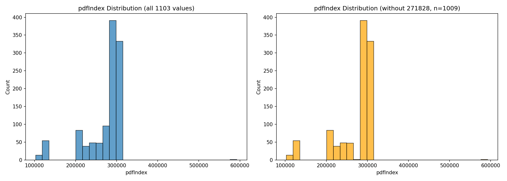

# onemil.xyz — 1,000+ Unique Sudoku Puzzles

I collected more than a thousand unique sudoku puzzles from [onemil.xyz](https://www.onemil.xyz).

**How it works:** Send a fingerprint to `/api/puzzle` → get a signed URL for the mapped PDF. Tokens expire in ~24 hours but can be refreshed by re-sending the same fingerprint.

A fingerprint is a deterministic 8-character base-36 string (`[a-z0-9]`) generated client-side from your browser profile — screen resolution, GPU, installed fonts, timezone, language, and other hardware details. Each unique fingerprint maps to one PDF file on the server. Full space: 36⁸ ≈ 2.8 trillion possible fingerprints.

(Originally posted on [discord.gg/PeArHATD](https://discord.gg/PeArHATD))

## Distribution

**1102 fingerprints sampled** (1008 unique puzzles, 94 default/271828). Range: 102,915 - 592,748. Median: 295,383.

## Known Mappings

| Fingerprint | pdfIndex | File | Notes |
|---|---|---|---|
| `00000000` | 271,828 | [271829.pdf](pdfs/271829.pdf) | ≈ e × 10⁵ |
| `00000001` | 104,343 | [104344.pdf](pdfs/104344.pdf) |  |
| `00000002` | 114,856 | [114857.pdf](pdfs/114857.pdf) |  |
| `00000003` | 114,869 | [114870.pdf](pdfs/114870.pdf) |  |
| `00000004` | 114,816 | [114817.pdf](pdfs/114817.pdf) |  |
| `00000005` | 114,874 | [114875.pdf](pdfs/114875.pdf) |  |
| `00000006` | 271,828 | [271829.pdf](pdfs/271829.pdf) | ≈ e × 10⁵ |
| `00000007` | 119,737 | [119738.pdf](pdfs/119738.pdf) |  |
| `00000008` | 119,710 | [119711.pdf](pdfs/119711.pdf) |  |
| `00000009` | 119,713 | [119714.pdf](pdfs/119714.pdf) |  |
| `00000010` | 113,549 | [113550.pdf](pdfs/113550.pdf) |  |
| `00000011` | 119,732 | [119733.pdf](pdfs/119733.pdf) |  |
| `00000012` | 119,711 | [119712.pdf](pdfs/119712.pdf) |  |
| `00000013` | 119,740 | [119741.pdf](pdfs/119741.pdf) |  |
| `00000014` | 119,726 | [119727.pdf](pdfs/119727.pdf) |  |
| `00000015` | 119,722 | [119723.pdf](pdfs/119723.pdf) |  |
| `00000016` | 119,739 | [119740.pdf](pdfs/119740.pdf) |  |
| `00000017` | 119,743 | [119744.pdf](pdfs/119744.pdf) |  |
| `00000018` | 119,797 | [119798.pdf](pdfs/119798.pdf) |  |
| `00000019` | 119,795 | [119796.pdf](pdfs/119796.pdf) |  |
| `00000020` | 119,720 | [119721.pdf](pdfs/119721.pdf) |  |
| `00000021` | 119,881 | [119882.pdf](pdfs/119882.pdf) |  |
| `00000022` | 119,800 | [119801.pdf](pdfs/119801.pdf) |  |
| `00000023` | 119,880 | [119881.pdf](pdfs/119881.pdf) |  |
| `00000024` | 119,879 | [119880.pdf](pdfs/119880.pdf) |  |
| `00000025` | 119,878 | [119879.pdf](pdfs/119879.pdf) |  |
| `00000026` | 119,877 | [119878.pdf](pdfs/119878.pdf) |  |
| `00000027` | 119,876 | [119877.pdf](pdfs/119877.pdf) |  |
| `00000028` | 119,875 | [119876.pdf](pdfs/119876.pdf) |  |
| `00000029` | 119,874 | [119875.pdf](pdfs/119875.pdf) |  |
| `00000030` | 119,867 | [119868.pdf](pdfs/119868.pdf) |  |
| `00000031` | 119,828 | [119829.pdf](pdfs/119829.pdf) |  |
| `00000032` | 119,826 | [119827.pdf](pdfs/119827.pdf) |  |
| `00000033` | 119,827 | [119828.pdf](pdfs/119828.pdf) |  |
| `00000034` | 119,829 | [119830.pdf](pdfs/119830.pdf) |  |
| `00000035` | 119,830 | [119831.pdf](pdfs/119831.pdf) |  |
| `00000036` | 102,975 | [102976.pdf](pdfs/102976.pdf) |  |
| `00000037` | 119,831 | [119832.pdf](pdfs/119832.pdf) |  |
| `00000038` | 119,832 | [119833.pdf](pdfs/119833.pdf) |  |
| `00000039` | 119,833 | [119834.pdf](pdfs/119834.pdf) |  |
| `00000040` | 119,811 | [119812.pdf](pdfs/119812.pdf) |  |
| `00000041` | 119,813 | [119814.pdf](pdfs/119814.pdf) |  |
| `00000042` | 119,815 | [119816.pdf](pdfs/119816.pdf) |  |
| `00000043` | 119,817 | [119818.pdf](pdfs/119818.pdf) |  |
| `00000044` | 119,819 | [119820.pdf](pdfs/119820.pdf) |  |
| `00000045` | 119,821 | [119822.pdf](pdfs/119822.pdf) |  |
| `00000046` | 119,836 | [119837.pdf](pdfs/119837.pdf) |  |
| `00000047` | 119,838 | [119839.pdf](pdfs/119839.pdf) |  |
| `00000048` | 119,801 | [119802.pdf](pdfs/119802.pdf) |  |
| `00000049` | 119,802 | [119803.pdf](pdfs/119803.pdf) |  |
| `00000050` | 119,854 | [119855.pdf](pdfs/119855.pdf) |  |
| `00000051` | 116,679 | [116680.pdf](pdfs/116680.pdf) |  |
| `00000052` | 119,860 | [119861.pdf](pdfs/119861.pdf) |  |
| `00000053` | 119,857 | [119858.pdf](pdfs/119858.pdf) |  |
| `00000054` | 119,859 | [119860.pdf](pdfs/119860.pdf) |  |
| `00000055` | 119,858 | [119859.pdf](pdfs/119859.pdf) |  |
| `00000056` | 119,856 | [119857.pdf](pdfs/119857.pdf) |  |
| `00000057` | 119,855 | [119856.pdf](pdfs/119856.pdf) |  |
| `00000058` | 119,853 | [119854.pdf](pdfs/119854.pdf) |  |
| `00000059` | 119,851 | [119852.pdf](pdfs/119852.pdf) |  |
| `00000060` | 119,840 | [119841.pdf](pdfs/119841.pdf) |  |
| `00000061` | 119,839 | [119840.pdf](pdfs/119840.pdf) |  |
| `00000062` | 119,837 | [119838.pdf](pdfs/119838.pdf) |  |
| `00000063` | 119,899 | [119900.pdf](pdfs/119900.pdf) |  |
| `00000064` | 215,963 | [215964.pdf](pdfs/215964.pdf) |  |
| `00000065` | 215,972 | [215973.pdf](pdfs/215973.pdf) |  |
| `00000066` | 215,920 | [215921.pdf](pdfs/215921.pdf) |  |
| `00000067` | 215,950 | [215951.pdf](pdfs/215951.pdf) |  |
| `00000068` | 215,986 | [215987.pdf](pdfs/215987.pdf) |  |
| `00000069` | 215,997 | [215998.pdf](pdfs/215998.pdf) |  |
| `00000070` | 215,910 | [215911.pdf](pdfs/215911.pdf) |  |
| `00000071` | 215,662 | [215663.pdf](pdfs/215663.pdf) |  |
| `00000072` | 215,683 | [215684.pdf](pdfs/215684.pdf) |  |
| `00000073` | 215,695 | [215696.pdf](pdfs/215696.pdf) |  |
| `00000074` | 215,606 | [215607.pdf](pdfs/215607.pdf) |  |
| `00000075` | 215,629 | [215630.pdf](pdfs/215630.pdf) |  |
| `00000076` | 215,650 | [215651.pdf](pdfs/215651.pdf) |  |
| `00000077` | 215,608 | [215609.pdf](pdfs/215609.pdf) |  |
| `00000078` | 215,653 | [215654.pdf](pdfs/215654.pdf) |  |
| `00000079` | 215,654 | [215655.pdf](pdfs/215655.pdf) |  |
| `00000080` | 215,625 | [215626.pdf](pdfs/215626.pdf) |  |
| `00000081` | 215,867 | [215868.pdf](pdfs/215868.pdf) |  |
| `00000082` | 215,875 | [215876.pdf](pdfs/215876.pdf) |  |
| `00000083` | 215,885 | [215886.pdf](pdfs/215886.pdf) |  |
| `00000084` | 215,893 | [215894.pdf](pdfs/215894.pdf) |  |
| `00000085` | 215,805 | [215806.pdf](pdfs/215806.pdf) |  |
| `00000086` | 215,823 | [215824.pdf](pdfs/215824.pdf) |  |
| `00000087` | 215,841 | [215842.pdf](pdfs/215842.pdf) |  |
| `00000088` | 215,810 | [215811.pdf](pdfs/215811.pdf) |  |
| `00000089` | 215,827 | [215828.pdf](pdfs/215828.pdf) |  |
| `00000090` | 215,807 | [215808.pdf](pdfs/215808.pdf) |  |
| `00000091` | 215,762 | [215763.pdf](pdfs/215763.pdf) |  |
| `00000092` | 215,769 | [215770.pdf](pdfs/215770.pdf) |  |
| `00000093` | 215,726 | [215727.pdf](pdfs/215727.pdf) |  |
| `00000094` | 215,706 | [215707.pdf](pdfs/215707.pdf) |  |
| `00000095` | 215,784 | [215785.pdf](pdfs/215785.pdf) |  |
| `00000096` | 215,708 | [215709.pdf](pdfs/215709.pdf) |  |
| `00000097` | 216,058 | [216059.pdf](pdfs/216059.pdf) |  |
| `00000098` | 216,067 | [216068.pdf](pdfs/216068.pdf) |  |
| `00000099` | 216,077 | [216078.pdf](pdfs/216078.pdf) |  |
| `00000100` | 213,188 | [213189.pdf](pdfs/213189.pdf) |  |
| `00000101` | 216,237 | [216238.pdf](pdfs/216238.pdf) |  |
| `00000102` | 216,233 | [216234.pdf](pdfs/216234.pdf) |  |
| `00000103` | 102,933 | [102934.pdf](pdfs/102934.pdf) |  |
| `00000104` | 216,452 | [216453.pdf](pdfs/216453.pdf) |  |
| `00000105` | 216,465 | [216466.pdf](pdfs/216466.pdf) |  |
| `00000106` | 216,472 | [216473.pdf](pdfs/216473.pdf) |  |
| `00000107` | 216,482 | [216483.pdf](pdfs/216483.pdf) |  |
| `00000108` | 216,411 | [216412.pdf](pdfs/216412.pdf) |  |
| `00000109` | 216,498 | [216499.pdf](pdfs/216499.pdf) |  |
| `00000110` | 216,404 | [216405.pdf](pdfs/216405.pdf) |  |
| `00000111` | 102,915 | [102916.pdf](pdfs/102916.pdf) |  |
| `00000112` | 216,437 | [216438.pdf](pdfs/216438.pdf) |  |
| `00000113` | 216,415 | [216416.pdf](pdfs/216416.pdf) |  |
| `00000114` | 216,423 | [216424.pdf](pdfs/216424.pdf) |  |
| `00000115` | 216,491 | [216492.pdf](pdfs/216492.pdf) |  |
| `00000116` | 216,356 | [216357.pdf](pdfs/216357.pdf) |  |
| `00000117` | 216,368 | [216369.pdf](pdfs/216369.pdf) |  |
| `00000118` | 216,377 | [216378.pdf](pdfs/216378.pdf) |  |
| `00000119` | 216,328 | [216329.pdf](pdfs/216329.pdf) |  |
| `00000120` | 102,931 | [102932.pdf](pdfs/102932.pdf) |  |
| `00000121` | 216,305 | [216306.pdf](pdfs/216306.pdf) |  |
| `00000122` | 216,315 | [216316.pdf](pdfs/216316.pdf) |  |
| `00000123` | 216,341 | [216342.pdf](pdfs/216342.pdf) |  |
| `00000124` | 216,354 | [216355.pdf](pdfs/216355.pdf) |  |
| `00000125` | 216,388 | [216389.pdf](pdfs/216389.pdf) |  |
| `00000126` | 216,307 | [216308.pdf](pdfs/216308.pdf) |  |
| `00000127` | 216,346 | [216347.pdf](pdfs/216347.pdf) |  |
| `00000128` | 216,558 | [216559.pdf](pdfs/216559.pdf) |  |
| `00000129` | 216,568 | [216569.pdf](pdfs/216569.pdf) |  |
| `00000130` | 216,575 | [216576.pdf](pdfs/216576.pdf) |  |
| `00000131` | 216,506 | [216507.pdf](pdfs/216507.pdf) |  |
| `00000132` | 216,503 | [216504.pdf](pdfs/216504.pdf) |  |
| `00000133` | 216,597 | [216598.pdf](pdfs/216598.pdf) |  |
| `00000134` | 216,527 | [216528.pdf](pdfs/216528.pdf) |  |
| `00000135` | 216,537 | [216538.pdf](pdfs/216538.pdf) |  |
| `00000136` | 216,583 | [216584.pdf](pdfs/216584.pdf) |  |
| `00000137` | 216,516 | [216517.pdf](pdfs/216517.pdf) |  |
| `00000138` | 216,522 | [216523.pdf](pdfs/216523.pdf) |  |
| `00000139` | 216,552 | [216553.pdf](pdfs/216553.pdf) |  |
| `00000140` | 216,863 | [216864.pdf](pdfs/216864.pdf) |  |
| `00000141` | 216,848 | [216849.pdf](pdfs/216849.pdf) |  |
| `00000142` | 216,839 | [216840.pdf](pdfs/216840.pdf) |  |
| `00000143` | 216,889 | [216890.pdf](pdfs/216890.pdf) |  |
| `00000144` | 216,898 | [216899.pdf](pdfs/216899.pdf) |  |
| `00000145` | 216,806 | [216807.pdf](pdfs/216807.pdf) |  |
| `00000146` | 216,821 | [216822.pdf](pdfs/216822.pdf) |  |
| `00000147` | 216,871 | [216872.pdf](pdfs/216872.pdf) |  |
| `00000148` | 216,805 | [216806.pdf](pdfs/216806.pdf) |  |
| `00000149` | 216,881 | [216882.pdf](pdfs/216882.pdf) |  |
| `00000150` | 246,633 | [246634.pdf](pdfs/246634.pdf) |  |
| `00000151` | 225,410 | [225411.pdf](pdfs/225411.pdf) |  |
| `00000152` | 246,640 | [246641.pdf](pdfs/246641.pdf) |  |
| `00000153` | 246,637 | [246638.pdf](pdfs/246638.pdf) |  |
| `00000154` | 246,639 | [246640.pdf](pdfs/246640.pdf) |  |
| `00000155` | 246,690 | [246691.pdf](pdfs/246691.pdf) |  |
| `00000156` | 246,691 | [246692.pdf](pdfs/246692.pdf) |  |
| `00000157` | 246,695 | [246696.pdf](pdfs/246696.pdf) |  |
| `00000158` | 246,693 | [246694.pdf](pdfs/246694.pdf) |  |
| `00000159` | 246,694 | [246695.pdf](pdfs/246695.pdf) |  |
| `00000160` | 246,817 | [246818.pdf](pdfs/246818.pdf) |  |
| `00000161` | 246,828 | [246829.pdf](pdfs/246829.pdf) |  |
| `00000162` | 246,818 | [246819.pdf](pdfs/246819.pdf) |  |
| `00000163` | 246,899 | [246900.pdf](pdfs/246900.pdf) |  |
| `00000164` | 246,897 | [246898.pdf](pdfs/246898.pdf) |  |
| `00000165` | 246,831 | [246832.pdf](pdfs/246832.pdf) |  |
| `00000166` | 246,816 | [246817.pdf](pdfs/246817.pdf) |  |
| `00000167` | 246,812 | [246813.pdf](pdfs/246813.pdf) |  |
| `00000168` | 246,801 | [246802.pdf](pdfs/246802.pdf) |  |
| `00000169` | 246,805 | [246806.pdf](pdfs/246806.pdf) |  |
| `00000170` | 246,778 | [246779.pdf](pdfs/246779.pdf) |  |
| `00000171` | 246,777 | [246778.pdf](pdfs/246778.pdf) |  |
| `00000172` | 246,780 | [246781.pdf](pdfs/246781.pdf) |  |
| `00000173` | 246,784 | [246785.pdf](pdfs/246785.pdf) |  |
| `00000174` | 246,781 | [246782.pdf](pdfs/246782.pdf) |  |
| `00000175` | 246,787 | [246788.pdf](pdfs/246788.pdf) |  |
| `00000176` | 225,435 | [225436.pdf](pdfs/225436.pdf) |  |
| `00000177` | 246,790 | [246791.pdf](pdfs/246791.pdf) |  |
| `00000178` | 246,791 | [246792.pdf](pdfs/246792.pdf) |  |
| `00000179` | 246,722 | [246723.pdf](pdfs/246723.pdf) |  |
| `00000180` | 246,715 | [246716.pdf](pdfs/246716.pdf) |  |
| `00000181` | 246,713 | [246714.pdf](pdfs/246714.pdf) |  |
| `00000182` | 246,900 | [246901.pdf](pdfs/246901.pdf) |  |
| `00000183` | 246,960 | [246961.pdf](pdfs/246961.pdf) |  |
| `00000184` | 246,965 | [246966.pdf](pdfs/246966.pdf) |  |
| `00000185` | 246,964 | [246965.pdf](pdfs/246965.pdf) |  |
| `00000186` | 246,968 | [246969.pdf](pdfs/246969.pdf) |  |
| `00000187` | 246,969 | [246970.pdf](pdfs/246970.pdf) |  |
| `00000188` | 246,972 | [246973.pdf](pdfs/246973.pdf) |  |
| `00000189` | 246,975 | [246976.pdf](pdfs/246976.pdf) |  |
| `00000190` | 246,910 | [246911.pdf](pdfs/246911.pdf) |  |
| `00000191` | 246,926 | [246927.pdf](pdfs/246927.pdf) |  |
| `00000192` | 246,922 | [246923.pdf](pdfs/246923.pdf) |  |
| `00000193` | 246,929 | [246930.pdf](pdfs/246930.pdf) |  |
| `00000194` | 246,927 | [246928.pdf](pdfs/246928.pdf) |  |
| `00000195` | 246,913 | [246914.pdf](pdfs/246914.pdf) |  |
| `00000196` | 246,991 | [246992.pdf](pdfs/246992.pdf) |  |
| `00000197` | 246,959 | [246960.pdf](pdfs/246960.pdf) |  |
| `00000198` | 246,988 | [246989.pdf](pdfs/246989.pdf) |  |
| `00000199` | 246,984 | [246985.pdf](pdfs/246985.pdf) |  |
| `00000200` | 271,828 | [271829.pdf](pdfs/271829.pdf) | ≈ e × 10⁵ |
| `00000201` | 225,495 | [225496.pdf](pdfs/225496.pdf) |  |
| `00000202` | 265,075 | [265076.pdf](pdfs/265076.pdf) |  |
| `00000203` | 265,078 | [265079.pdf](pdfs/265079.pdf) |  |
| `00000204` | 265,080 | [265081.pdf](pdfs/265081.pdf) |  |
| `00000205` | 265,083 | [265084.pdf](pdfs/265084.pdf) |  |
| `00000206` | 265,085 | [265086.pdf](pdfs/265086.pdf) |  |
| `00000207` | 265,088 | [265089.pdf](pdfs/265089.pdf) |  |
| `00000208` | 265,089 | [265090.pdf](pdfs/265090.pdf) |  |
| `00000209` | 265,091 | [265092.pdf](pdfs/265092.pdf) |  |
| `00000210` | 265,094 | [265095.pdf](pdfs/265095.pdf) |  |
| `00000211` | 265,095 | [265096.pdf](pdfs/265096.pdf) |  |
| `00000212` | 265,099 | [265100.pdf](pdfs/265100.pdf) |  |
| `00000213` | 265,001 | [265002.pdf](pdfs/265002.pdf) |  |
| `00000214` | 265,006 | [265007.pdf](pdfs/265007.pdf) |  |
| `00000215` | 265,010 | [265011.pdf](pdfs/265011.pdf) |  |
| `00000216` | 265,013 | [265014.pdf](pdfs/265014.pdf) |  |
| `00000217` | 265,020 | [265021.pdf](pdfs/265021.pdf) |  |
| `00000218` | 265,022 | [265023.pdf](pdfs/265023.pdf) |  |
| `00000219` | 265,028 | [265029.pdf](pdfs/265029.pdf) |  |
| `00000220` | 265,033 | [265034.pdf](pdfs/265034.pdf) |  |
| `00000221` | 265,038 | [265039.pdf](pdfs/265039.pdf) |  |
| `00000222` | 265,044 | [265045.pdf](pdfs/265045.pdf) |  |
| `00000223` | 265,048 | [265049.pdf](pdfs/265049.pdf) |  |
| `00000224` | 265,050 | [265051.pdf](pdfs/265051.pdf) |  |
| `00000225` | 265,057 | [265058.pdf](pdfs/265058.pdf) |  |
| `00000226` | 225,403 | [225404.pdf](pdfs/225404.pdf) |  |
| `00000227` | 265,019 | [265020.pdf](pdfs/265020.pdf) |  |
| `00000228` | 265,027 | [265028.pdf](pdfs/265028.pdf) |  |
| `00000229` | 265,041 | [265042.pdf](pdfs/265042.pdf) |  |
| `00000230` | 265,016 | [265017.pdf](pdfs/265017.pdf) |  |
| `00000231` | 265,011 | [265012.pdf](pdfs/265012.pdf) |  |
| `00000232` | 265,043 | [265044.pdf](pdfs/265044.pdf) |  |
| `00000233` | 265,018 | [265019.pdf](pdfs/265019.pdf) |  |
| `00000234` | 265,003 | [265004.pdf](pdfs/265004.pdf) |  |
| `00000235` | 265,060 | [265061.pdf](pdfs/265061.pdf) |  |
| `00000236` | 265,036 | [265037.pdf](pdfs/265037.pdf) |  |
| `00000237` | 265,008 | [265009.pdf](pdfs/265009.pdf) |  |
| `00000238` | 265,035 | [265036.pdf](pdfs/265036.pdf) |  |
| `00000239` | 265,164 | [265165.pdf](pdfs/265165.pdf) |  |
| `00000240` | 265,166 | [265167.pdf](pdfs/265167.pdf) |  |
| `00000241` | 265,169 | [265170.pdf](pdfs/265170.pdf) |  |
| `00000242` | 265,170 | [265171.pdf](pdfs/265171.pdf) |  |
| `00000243` | 265,174 | [265175.pdf](pdfs/265175.pdf) |  |
| `00000244` | 265,177 | [265178.pdf](pdfs/265178.pdf) |  |
| `00000245` | 265,179 | [265180.pdf](pdfs/265180.pdf) |  |
| `00000246` | 265,146 | [265147.pdf](pdfs/265147.pdf) |  |
| `00000247` | 265,143 | [265144.pdf](pdfs/265144.pdf) |  |
| `00000248` | 265,141 | [265142.pdf](pdfs/265142.pdf) |  |
| `00000249` | 265,140 | [265141.pdf](pdfs/265141.pdf) |  |
| `00000250` | 271,828 | [271829.pdf](pdfs/271829.pdf) | ≈ e × 10⁵ |
| `00000251` | 225,416 | [225417.pdf](pdfs/225417.pdf) |  |
| `00000252` | 271,828 | [271829.pdf](pdfs/271829.pdf) | ≈ e × 10⁵ |
| `00000253` | 271,828 | [271829.pdf](pdfs/271829.pdf) | ≈ e × 10⁵ |
| `00000254` | 271,828 | [271829.pdf](pdfs/271829.pdf) | ≈ e × 10⁵ |
| `00000255` | 271,828 | [271829.pdf](pdfs/271829.pdf) | ≈ e × 10⁵ |
| `00000256` | 271,828 | [271829.pdf](pdfs/271829.pdf) | ≈ e × 10⁵ |
| `00000257` | 271,828 | [271829.pdf](pdfs/271829.pdf) | ≈ e × 10⁵ |
| `00000258` | 271,828 | [271829.pdf](pdfs/271829.pdf) | ≈ e × 10⁵ |
| `00000259` | 271,828 | [271829.pdf](pdfs/271829.pdf) | ≈ e × 10⁵ |
| `00000260` | 271,828 | [271829.pdf](pdfs/271829.pdf) | ≈ e × 10⁵ |
| `00000261` | 271,828 | [271829.pdf](pdfs/271829.pdf) | ≈ e × 10⁵ |
| `00000262` | 271,828 | [271829.pdf](pdfs/271829.pdf) | ≈ e × 10⁵ |
| `00000263` | 271,828 | [271829.pdf](pdfs/271829.pdf) | ≈ e × 10⁵ |
| `00000264` | 271,828 | [271829.pdf](pdfs/271829.pdf) | ≈ e × 10⁵ |
| `00000265` | 274,649 | [274650.pdf](pdfs/274650.pdf) |  |
| `00000266` | 271,828 | [271829.pdf](pdfs/271829.pdf) | ≈ e × 10⁵ |
| `00000267` | 293,648 | [293649.pdf](pdfs/293649.pdf) |  |
| `00000268` | 293,630 | [293631.pdf](pdfs/293631.pdf) |  |
| `00000269` | 293,748 | [293749.pdf](pdfs/293749.pdf) |  |
| `00000270` | 293,756 | [293757.pdf](pdfs/293757.pdf) |  |
| `00000271` | 293,764 | [293765.pdf](pdfs/293765.pdf) |  |
| `00000272` | 293,771 | [293772.pdf](pdfs/293772.pdf) |  |
| `00000273` | 293,778 | [293779.pdf](pdfs/293779.pdf) |  |
| `00000274` | 293,785 | [293786.pdf](pdfs/293786.pdf) |  |
| `00000275` | 293,797 | [293798.pdf](pdfs/293798.pdf) |  |
| `00000276` | 225,606 | [225607.pdf](pdfs/225607.pdf) |  |
| `00000277` | 293,708 | [293709.pdf](pdfs/293709.pdf) |  |
| `00000278` | 293,721 | [293722.pdf](pdfs/293722.pdf) |  |
| `00000279` | 293,738 | [293739.pdf](pdfs/293739.pdf) |  |
| `00000280` | 293,736 | [293737.pdf](pdfs/293737.pdf) |  |
| `00000281` | 293,763 | [293764.pdf](pdfs/293764.pdf) |  |
| `00000282` | 293,742 | [293743.pdf](pdfs/293743.pdf) |  |
| `00000283` | 293,839 | [293840.pdf](pdfs/293840.pdf) |  |
| `00000284` | 293,832 | [293833.pdf](pdfs/293833.pdf) |  |
| `00000285` | 293,825 | [293826.pdf](pdfs/293826.pdf) |  |
| `00000286` | 293,855 | [293856.pdf](pdfs/293856.pdf) |  |
| `00000287` | 293,862 | [293863.pdf](pdfs/293863.pdf) |  |
| `00000288` | 293,868 | [293869.pdf](pdfs/293869.pdf) |  |
| `00000289` | 293,805 | [293806.pdf](pdfs/293806.pdf) |  |
| `00000290` | 293,880 | [293881.pdf](pdfs/293881.pdf) |  |
| `00000291` | 293,887 | [293888.pdf](pdfs/293888.pdf) |  |
| `00000292` | 293,897 | [293898.pdf](pdfs/293898.pdf) |  |
| `00000293` | 293,802 | [293803.pdf](pdfs/293803.pdf) |  |
| `00000294` | 293,822 | [293823.pdf](pdfs/293823.pdf) |  |
| `00000295` | 293,815 | [293816.pdf](pdfs/293816.pdf) |  |
| `00000296` | 293,812 | [293813.pdf](pdfs/293813.pdf) |  |
| `00000297` | 293,974 | [293975.pdf](pdfs/293975.pdf) |  |
| `00000298` | 293,976 | [293977.pdf](pdfs/293977.pdf) |  |
| `00000299` | 293,919 | [293920.pdf](pdfs/293920.pdf) |  |
| `00000300` | 293,915 | [293916.pdf](pdfs/293916.pdf) |  |
| `00000301` | 225,675 | [225676.pdf](pdfs/225676.pdf) |  |
| `00000302` | 293,938 | [293939.pdf](pdfs/293939.pdf) |  |
| `00000303` | 293,947 | [293948.pdf](pdfs/293948.pdf) |  |
| `00000304` | 293,989 | [293990.pdf](pdfs/293990.pdf) |  |
| `00000305` | 293,996 | [293997.pdf](pdfs/293997.pdf) |  |
| `00000306` | 293,964 | [293965.pdf](pdfs/293965.pdf) |  |
| `00000307` | 293,971 | [293972.pdf](pdfs/293972.pdf) |  |
| `00000308` | 293,983 | [293984.pdf](pdfs/293984.pdf) |  |
| `00000309` | 293,960 | [293961.pdf](pdfs/293961.pdf) |  |
| `00000310` | 293,955 | [293956.pdf](pdfs/293956.pdf) |  |
| `00000311` | 293,929 | [293930.pdf](pdfs/293930.pdf) |  |
| `00000312` | 294,023 | [294024.pdf](pdfs/294024.pdf) |  |
| `00000313` | 294,019 | [294020.pdf](pdfs/294020.pdf) |  |
| `00000314` | 294,041 | [294042.pdf](pdfs/294042.pdf) |  |
| `00000315` | 294,053 | [294054.pdf](pdfs/294054.pdf) |  |
| `00000316` | 294,084 | [294085.pdf](pdfs/294085.pdf) |  |
| `00000317` | 294,095 | [294096.pdf](pdfs/294096.pdf) |  |
| `00000318` | 294,012 | [294013.pdf](pdfs/294013.pdf) |  |
| `00000319` | 294,062 | [294063.pdf](pdfs/294063.pdf) |  |
| `00000320` | 294,069 | [294070.pdf](pdfs/294070.pdf) |  |
| `00000321` | 294,078 | [294079.pdf](pdfs/294079.pdf) |  |
| `00000322` | 294,026 | [294027.pdf](pdfs/294027.pdf) |  |
| `00000323` | 294,007 | [294008.pdf](pdfs/294008.pdf) |  |
| `00000324` | 294,089 | [294090.pdf](pdfs/294090.pdf) |  |
| `00000325` | 294,132 | [294133.pdf](pdfs/294133.pdf) |  |
| `00000326` | 225,636 | [225637.pdf](pdfs/225637.pdf) |  |
| `00000327` | 294,118 | [294119.pdf](pdfs/294119.pdf) |  |
| `00000328` | 294,151 | [294152.pdf](pdfs/294152.pdf) |  |
| `00000329` | 294,185 | [294186.pdf](pdfs/294186.pdf) |  |
| `00000330` | 294,190 | [294191.pdf](pdfs/294191.pdf) |  |
| `00000331` | 294,146 | [294147.pdf](pdfs/294147.pdf) |  |
| `00000332` | 294,163 | [294164.pdf](pdfs/294164.pdf) |  |
| `00000333` | 294,171 | [294172.pdf](pdfs/294172.pdf) |  |
| `00000334` | 294,178 | [294179.pdf](pdfs/294179.pdf) |  |
| `00000335` | 294,199 | [294200.pdf](pdfs/294200.pdf) |  |
| `00000336` | 294,102 | [294103.pdf](pdfs/294103.pdf) |  |
| `00000337` | 294,142 | [294143.pdf](pdfs/294143.pdf) |  |
| `00000338` | 294,101 | [294102.pdf](pdfs/294102.pdf) |  |
| `00000339` | 294,233 | [294234.pdf](pdfs/294234.pdf) |  |
| `00000340` | 294,226 | [294227.pdf](pdfs/294227.pdf) |  |
| `00000341` | 294,248 | [294249.pdf](pdfs/294249.pdf) |  |
| `00000342` | 294,255 | [294256.pdf](pdfs/294256.pdf) |  |
| `00000343` | 294,246 | [294247.pdf](pdfs/294247.pdf) |  |
| `00000344` | 294,295 | [294296.pdf](pdfs/294296.pdf) |  |
| `00000345` | 294,273 | [294274.pdf](pdfs/294274.pdf) |  |
| `00000346` | 294,280 | [294281.pdf](pdfs/294281.pdf) |  |
| `00000347` | 294,296 | [294297.pdf](pdfs/294297.pdf) |  |
| `00000348` | 294,215 | [294216.pdf](pdfs/294216.pdf) |  |
| `00000349` | 294,204 | [294205.pdf](pdfs/294205.pdf) |  |
| `00000350` | 294,265 | [294266.pdf](pdfs/294266.pdf) |  |
| `00000351` | 225,654 | [225655.pdf](pdfs/225655.pdf) |  |
| `00000352` | 294,259 | [294260.pdf](pdfs/294260.pdf) |  |
| `00000353` | 294,331 | [294332.pdf](pdfs/294332.pdf) |  |
| `00000354` | 294,325 | [294326.pdf](pdfs/294326.pdf) |  |
| `00000355` | 294,318 | [294319.pdf](pdfs/294319.pdf) |  |
| `00000356` | 294,344 | [294345.pdf](pdfs/294345.pdf) |  |
| `00000357` | 294,361 | [294362.pdf](pdfs/294362.pdf) |  |
| `00000358` | 294,369 | [294370.pdf](pdfs/294370.pdf) |  |
| `00000359` | 294,377 | [294378.pdf](pdfs/294378.pdf) |  |
| `00000360` | 294,383 | [294384.pdf](pdfs/294384.pdf) |  |
| `00000361` | 294,393 | [294394.pdf](pdfs/294394.pdf) |  |
| `00000362` | 294,300 | [294301.pdf](pdfs/294301.pdf) |  |
| `00000363` | 294,310 | [294311.pdf](pdfs/294311.pdf) |  |
| `00000364` | 294,358 | [294359.pdf](pdfs/294359.pdf) |  |
| `00000365` | 294,348 | [294349.pdf](pdfs/294349.pdf) |  |
| `00000366` | 294,441 | [294442.pdf](pdfs/294442.pdf) |  |
| `00000367` | 294,445 | [294446.pdf](pdfs/294446.pdf) |  |
| `00000368` | 294,453 | [294454.pdf](pdfs/294454.pdf) |  |
| `00000369` | 294,462 | [294463.pdf](pdfs/294463.pdf) |  |
| `00000370` | 294,469 | [294470.pdf](pdfs/294470.pdf) |  |
| `00000371` | 294,476 | [294477.pdf](pdfs/294477.pdf) |  |
| `00000372` | 294,483 | [294484.pdf](pdfs/294484.pdf) |  |
| `00000373` | 294,490 | [294491.pdf](pdfs/294491.pdf) |  |
| `00000374` | 294,497 | [294498.pdf](pdfs/294498.pdf) |  |
| `00000375` | 294,410 | [294411.pdf](pdfs/294411.pdf) |  |
| `00000376` | 225,628 | [225629.pdf](pdfs/225629.pdf) |  |
| `00000377` | 294,426 | [294427.pdf](pdfs/294427.pdf) |  |
| `00000378` | 294,403 | [294404.pdf](pdfs/294404.pdf) |  |
| `00000379` | 294,435 | [294436.pdf](pdfs/294436.pdf) |  |
| `00000380` | 294,434 | [294435.pdf](pdfs/294435.pdf) |  |
| `00000381` | 294,649 | [294650.pdf](pdfs/294650.pdf) |  |
| `00000382` | 294,633 | [294634.pdf](pdfs/294634.pdf) |  |
| `00000383` | 294,660 | [294661.pdf](pdfs/294661.pdf) |  |
| `00000384` | 294,619 | [294620.pdf](pdfs/294620.pdf) |  |
| `00000385` | 294,677 | [294678.pdf](pdfs/294678.pdf) |  |
| `00000386` | 294,684 | [294685.pdf](pdfs/294685.pdf) |  |
| `00000387` | 294,692 | [294693.pdf](pdfs/294693.pdf) |  |
| `00000388` | 294,699 | [294700.pdf](pdfs/294700.pdf) |  |
| `00000389` | 294,600 | [294601.pdf](pdfs/294601.pdf) |  |
| `00000390` | 294,652 | [294653.pdf](pdfs/294653.pdf) |  |
| `00000391` | 294,671 | [294672.pdf](pdfs/294672.pdf) |  |
| `00000392` | 294,658 | [294659.pdf](pdfs/294659.pdf) |  |
| `00000393` | 294,670 | [294671.pdf](pdfs/294671.pdf) |  |
| `00000394` | 294,538 | [294539.pdf](pdfs/294539.pdf) |  |
| `00000395` | 294,535 | [294536.pdf](pdfs/294536.pdf) |  |
| `00000396` | 294,562 | [294563.pdf](pdfs/294563.pdf) |  |
| `00000397` | 294,569 | [294570.pdf](pdfs/294570.pdf) |  |
| `00000398` | 294,576 | [294577.pdf](pdfs/294577.pdf) |  |
| `00000399` | 294,583 | [294584.pdf](pdfs/294584.pdf) |  |
| `00000400` | 294,588 | [294589.pdf](pdfs/294589.pdf) |  |
| `00000401` | 225,615 | [225616.pdf](pdfs/225616.pdf) |  |
| `00000402` | 294,599 | [294600.pdf](pdfs/294600.pdf) |  |
| `00000403` | 294,511 | [294512.pdf](pdfs/294512.pdf) |  |
| `00000404` | 294,526 | [294527.pdf](pdfs/294527.pdf) |  |
| `00000405` | 294,587 | [294588.pdf](pdfs/294588.pdf) |  |
| `00000406` | 294,551 | [294552.pdf](pdfs/294552.pdf) |  |
| `00000407` | 294,585 | [294586.pdf](pdfs/294586.pdf) |  |
| `00000408` | 294,769 | [294770.pdf](pdfs/294770.pdf) |  |
| `00000409` | 294,766 | [294767.pdf](pdfs/294767.pdf) |  |
| `00000410` | 294,723 | [294724.pdf](pdfs/294724.pdf) |  |
| `00000411` | 294,709 | [294710.pdf](pdfs/294710.pdf) |  |
| `00000412` | 294,775 | [294776.pdf](pdfs/294776.pdf) |  |
| `00000413` | 294,783 | [294784.pdf](pdfs/294784.pdf) |  |
| `00000414` | 294,733 | [294734.pdf](pdfs/294734.pdf) |  |
| `00000415` | 294,756 | [294757.pdf](pdfs/294757.pdf) |  |
| `00000416` | 294,761 | [294762.pdf](pdfs/294762.pdf) |  |
| `00000417` | 294,729 | [294730.pdf](pdfs/294730.pdf) |  |
| `00000418` | 294,764 | [294765.pdf](pdfs/294765.pdf) |  |
| `00000419` | 294,736 | [294737.pdf](pdfs/294737.pdf) |  |
| `00000420` | 294,742 | [294743.pdf](pdfs/294743.pdf) |  |
| `00000421` | 294,748 | [294749.pdf](pdfs/294749.pdf) |  |
| `00000422` | 294,955 | [294956.pdf](pdfs/294956.pdf) |  |
| `00000423` | 294,949 | [294950.pdf](pdfs/294950.pdf) |  |
| `00000424` | 294,942 | [294943.pdf](pdfs/294943.pdf) |  |
| `00000425` | 294,990 | [294991.pdf](pdfs/294991.pdf) |  |
| `00000426` | 225,876 | [225877.pdf](pdfs/225877.pdf) |  |
| `00000427` | 294,977 | [294978.pdf](pdfs/294978.pdf) |  |
| `00000428` | 294,984 | [294985.pdf](pdfs/294985.pdf) |  |
| `00000429` | 294,903 | [294904.pdf](pdfs/294904.pdf) |  |
| `00000430` | 294,912 | [294913.pdf](pdfs/294913.pdf) |  |
| `00000431` | 294,925 | [294926.pdf](pdfs/294926.pdf) |  |
| `00000432` | 294,964 | [294965.pdf](pdfs/294965.pdf) |  |
| `00000433` | 294,948 | [294949.pdf](pdfs/294949.pdf) |  |
| `00000434` | 294,934 | [294935.pdf](pdfs/294935.pdf) |  |
| `00000435` | 294,930 | [294931.pdf](pdfs/294931.pdf) |  |
| `00000436` | 294,832 | [294833.pdf](pdfs/294833.pdf) |  |
| `00000437` | 294,825 | [294826.pdf](pdfs/294826.pdf) |  |
| `00000438` | 294,819 | [294820.pdf](pdfs/294820.pdf) |  |
| `00000439` | 294,813 | [294814.pdf](pdfs/294814.pdf) |  |
| `00000440` | 294,805 | [294806.pdf](pdfs/294806.pdf) |  |
| `00000441` | 294,849 | [294850.pdf](pdfs/294850.pdf) |  |
| `00000442` | 294,877 | [294878.pdf](pdfs/294878.pdf) |  |
| `00000443` | 294,884 | [294885.pdf](pdfs/294885.pdf) |  |
| `00000444` | 294,891 | [294892.pdf](pdfs/294892.pdf) |  |
| `00000445` | 294,898 | [294899.pdf](pdfs/294899.pdf) |  |
| `00000446` | 294,851 | [294852.pdf](pdfs/294852.pdf) |  |
| `00000447` | 294,866 | [294867.pdf](pdfs/294867.pdf) |  |
| `00000448` | 294,857 | [294858.pdf](pdfs/294858.pdf) |  |
| `00000449` | 294,869 | [294870.pdf](pdfs/294870.pdf) |  |
| `00000450` | 295,132 | [295133.pdf](pdfs/295133.pdf) |  |
| `00000451` | 225,851 | [225852.pdf](pdfs/225852.pdf) |  |
| `00000452` | 295,123 | [295124.pdf](pdfs/295124.pdf) |  |
| `00000453` | 295,117 | [295118.pdf](pdfs/295118.pdf) |  |
| `00000454` | 295,149 | [295150.pdf](pdfs/295150.pdf) |  |
| `00000455` | 295,150 | [295151.pdf](pdfs/295151.pdf) |  |
| `00000456` | 295,174 | [295175.pdf](pdfs/295175.pdf) |  |
| `00000457` | 295,181 | [295182.pdf](pdfs/295182.pdf) |  |
| `00000458` | 295,188 | [295189.pdf](pdfs/295189.pdf) |  |
| `00000459` | 295,195 | [295196.pdf](pdfs/295196.pdf) |  |
| `00000460` | 295,101 | [295102.pdf](pdfs/295102.pdf) |  |
| `00000461` | 295,139 | [295140.pdf](pdfs/295140.pdf) |  |
| `00000462` | 295,108 | [295109.pdf](pdfs/295109.pdf) |  |
| `00000463` | 295,112 | [295113.pdf](pdfs/295113.pdf) |  |
| `00000464` | 295,034 | [295035.pdf](pdfs/295035.pdf) |  |
| `00000465` | 295,028 | [295029.pdf](pdfs/295029.pdf) |  |
| `00000466` | 295,047 | [295048.pdf](pdfs/295048.pdf) |  |
| `00000467` | 295,055 | [295056.pdf](pdfs/295056.pdf) |  |
| `00000468` | 295,062 | [295063.pdf](pdfs/295063.pdf) |  |
| `00000469` | 295,069 | [295070.pdf](pdfs/295070.pdf) |  |
| `00000470` | 295,077 | [295078.pdf](pdfs/295078.pdf) |  |
| `00000471` | 295,085 | [295086.pdf](pdfs/295086.pdf) |  |
| `00000472` | 295,093 | [295094.pdf](pdfs/295094.pdf) |  |
| `00000473` | 295,004 | [295005.pdf](pdfs/295005.pdf) |  |
| `00000474` | 295,012 | [295013.pdf](pdfs/295013.pdf) |  |
| `00000475` | 295,042 | [295043.pdf](pdfs/295043.pdf) |  |
| `00000476` | 225,800 | [225801.pdf](pdfs/225801.pdf) |  |
| `00000477` | 295,040 | [295041.pdf](pdfs/295041.pdf) |  |
| `00000478` | 295,343 | [295344.pdf](pdfs/295344.pdf) |  |
| `00000479` | 295,350 | [295351.pdf](pdfs/295351.pdf) |  |
| `00000480` | 295,329 | [295330.pdf](pdfs/295330.pdf) |  |
| `00000481` | 295,366 | [295367.pdf](pdfs/295367.pdf) |  |
| `00000482` | 295,373 | [295374.pdf](pdfs/295374.pdf) |  |
| `00000483` | 295,395 | [295396.pdf](pdfs/295396.pdf) |  |
| `00000484` | 295,383 | [295384.pdf](pdfs/295384.pdf) |  |
| `00000485` | 295,389 | [295390.pdf](pdfs/295390.pdf) |  |
| `00000486` | 295,308 | [295309.pdf](pdfs/295309.pdf) |  |
| `00000487` | 295,324 | [295325.pdf](pdfs/295325.pdf) |  |
| `00000488` | 295,364 | [295365.pdf](pdfs/295365.pdf) |  |
| `00000489` | 295,334 | [295335.pdf](pdfs/295335.pdf) |  |
| `00000490` | 295,349 | [295350.pdf](pdfs/295350.pdf) |  |
| `00000491` | 295,242 | [295243.pdf](pdfs/295243.pdf) |  |
| `00000492` | 295,235 | [295236.pdf](pdfs/295236.pdf) |  |
| `00000493` | 295,227 | [295228.pdf](pdfs/295228.pdf) |  |
| `00000494` | 295,263 | [295264.pdf](pdfs/295264.pdf) |  |
| `00000495` | 295,213 | [295214.pdf](pdfs/295214.pdf) |  |
| `00000496` | 295,221 | [295222.pdf](pdfs/295222.pdf) |  |
| `00000497` | 295,249 | [295250.pdf](pdfs/295250.pdf) |  |
| `00000498` | 295,289 | [295290.pdf](pdfs/295290.pdf) |  |
| `00000499` | 295,200 | [295201.pdf](pdfs/295201.pdf) |  |
| `00000500` | 296,088 | [296089.pdf](pdfs/296089.pdf) |  |
| `00000501` | 225,830 | [225831.pdf](pdfs/225831.pdf) |  |
| `00000502` | 271,828 | [271829.pdf](pdfs/271829.pdf) | ≈ e × 10⁵ |
| `00000503` | 296,012 | [296013.pdf](pdfs/296013.pdf) |  |
| `00000504` | 296,021 | [296022.pdf](pdfs/296022.pdf) |  |
| `00000505` | 296,085 | [296086.pdf](pdfs/296086.pdf) |  |
| `00000506` | 271,828 | [271829.pdf](pdfs/271829.pdf) | ≈ e × 10⁵ |
| `00000507` | 296,346 | [296347.pdf](pdfs/296347.pdf) |  |
| `00000508` | 271,828 | [271829.pdf](pdfs/271829.pdf) | ≈ e × 10⁵ |
| `00000509` | 296,329 | [296330.pdf](pdfs/296330.pdf) |  |
| `00000510` | 296,324 | [296325.pdf](pdfs/296325.pdf) |  |
| `00000511` | 271,828 | [271829.pdf](pdfs/271829.pdf) | ≈ e × 10⁵ |
| `00000512` | 296,366 | [296367.pdf](pdfs/296367.pdf) |  |
| `00000513` | 296,375 | [296376.pdf](pdfs/296376.pdf) |  |
| `00000514` | 296,322 | [296323.pdf](pdfs/296323.pdf) |  |
| `00000515` | 296,352 | [296353.pdf](pdfs/296353.pdf) |  |
| `00000516` | 296,360 | [296361.pdf](pdfs/296361.pdf) |  |
| `00000517` | 296,353 | [296354.pdf](pdfs/296354.pdf) |  |
| `00000518` | 296,344 | [296345.pdf](pdfs/296345.pdf) |  |
| `00000519` | 296,236 | [296237.pdf](pdfs/296237.pdf) |  |
| `00000520` | 296,231 | [296232.pdf](pdfs/296232.pdf) |  |
| `00000521` | 296,214 | [296215.pdf](pdfs/296215.pdf) |  |
| `00000522` | 296,298 | [296299.pdf](pdfs/296299.pdf) |  |
| `00000523` | 296,245 | [296246.pdf](pdfs/296246.pdf) |  |
| `00000524` | 296,263 | [296264.pdf](pdfs/296264.pdf) |  |
| `00000525` | 296,278 | [296279.pdf](pdfs/296279.pdf) |  |
| `00000526` | 225,817 | [225818.pdf](pdfs/225818.pdf) |  |
| `00000527` | 296,453 | [296454.pdf](pdfs/296454.pdf) |  |
| `00000528` | 296,425 | [296426.pdf](pdfs/296426.pdf) |  |
| `00000529` | 296,487 | [296488.pdf](pdfs/296488.pdf) |  |
| `00000530` | 296,475 | [296476.pdf](pdfs/296476.pdf) |  |
| `00000531` | 296,480 | [296481.pdf](pdfs/296481.pdf) |  |
| `00000532` | 296,403 | [296404.pdf](pdfs/296404.pdf) |  |
| `00000533` | 296,430 | [296431.pdf](pdfs/296431.pdf) |  |
| `00000534` | 296,455 | [296456.pdf](pdfs/296456.pdf) |  |
| `00000535` | 296,551 | [296552.pdf](pdfs/296552.pdf) |  |
| `00000536` | 296,535 | [296536.pdf](pdfs/296536.pdf) |  |
| `00000537` | 296,529 | [296530.pdf](pdfs/296530.pdf) |  |
| `00000538` | 296,572 | [296573.pdf](pdfs/296573.pdf) |  |
| `00000539` | 296,582 | [296583.pdf](pdfs/296583.pdf) |  |
| `00000540` | 296,595 | [296596.pdf](pdfs/296596.pdf) |  |
| `00000541` | 296,555 | [296556.pdf](pdfs/296556.pdf) |  |
| `00000542` | 296,515 | [296516.pdf](pdfs/296516.pdf) |  |
| `00000543` | 296,559 | [296560.pdf](pdfs/296560.pdf) |  |
| `00000544` | 296,737 | [296738.pdf](pdfs/296738.pdf) |  |
| `00000545` | 296,726 | [296727.pdf](pdfs/296727.pdf) |  |
| `00000546` | 296,720 | [296721.pdf](pdfs/296721.pdf) |  |
| `00000547` | 296,769 | [296770.pdf](pdfs/296770.pdf) |  |
| `00000548` | 296,701 | [296702.pdf](pdfs/296702.pdf) |  |
| `00000549` | 296,712 | [296713.pdf](pdfs/296713.pdf) |  |
| `00000550` | 296,710 | [296711.pdf](pdfs/296711.pdf) |  |
| `00000551` | 225,843 | [225844.pdf](pdfs/225844.pdf) |  |
| `00000552` | 296,753 | [296754.pdf](pdfs/296754.pdf) |  |
| `00000553` | 296,728 | [296729.pdf](pdfs/296729.pdf) |  |
| `00000554` | 296,631 | [296632.pdf](pdfs/296632.pdf) |  |
| `00000555` | 296,624 | [296625.pdf](pdfs/296625.pdf) |  |
| `00000556` | 296,635 | [296636.pdf](pdfs/296636.pdf) |  |
| `00000557` | 296,608 | [296609.pdf](pdfs/296609.pdf) |  |
| `00000558` | 296,649 | [296650.pdf](pdfs/296650.pdf) |  |
| `00000559` | 296,667 | [296668.pdf](pdfs/296668.pdf) |  |
| `00000560` | 296,674 | [296675.pdf](pdfs/296675.pdf) |  |
| `00000561` | 296,680 | [296681.pdf](pdfs/296681.pdf) |  |
| `00000562` | 296,687 | [296688.pdf](pdfs/296688.pdf) |  |
| `00000563` | 296,617 | [296618.pdf](pdfs/296618.pdf) |  |
| `00000564` | 296,643 | [296644.pdf](pdfs/296644.pdf) |  |
| `00000565` | 296,661 | [296662.pdf](pdfs/296662.pdf) |  |
| `00000566` | 296,645 | [296646.pdf](pdfs/296646.pdf) |  |
| `00000567` | 296,935 | [296936.pdf](pdfs/296936.pdf) |  |
| `00000568` | 296,930 | [296931.pdf](pdfs/296931.pdf) |  |
| `00000569` | 296,941 | [296942.pdf](pdfs/296942.pdf) |  |
| `00000570` | 296,948 | [296949.pdf](pdfs/296949.pdf) |  |
| `00000571` | 296,956 | [296957.pdf](pdfs/296957.pdf) |  |
| `00000572` | 296,998 | [296999.pdf](pdfs/296999.pdf) |  |
| `00000573` | 296,970 | [296971.pdf](pdfs/296971.pdf) |  |
| `00000574` | 296,904 | [296905.pdf](pdfs/296905.pdf) |  |
| `00000575` | 296,986 | [296987.pdf](pdfs/296987.pdf) |  |
| `00000576` | 225,813 | [225814.pdf](pdfs/225814.pdf) |  |
| `00000577` | 296,962 | [296963.pdf](pdfs/296963.pdf) |  |
| `00000578` | 271,828 | [271829.pdf](pdfs/271829.pdf) | ≈ e × 10⁵ |
| `00000579` | 296,822 | [296823.pdf](pdfs/296823.pdf) |  |
| `00000580` | 296,823 | [296824.pdf](pdfs/296824.pdf) |  |
| `00000581` | 296,814 | [296815.pdf](pdfs/296815.pdf) |  |
| `00000582` | 296,848 | [296849.pdf](pdfs/296849.pdf) |  |
| `00000583` | 296,863 | [296864.pdf](pdfs/296864.pdf) |  |
| `00000584` | 271,828 | [271829.pdf](pdfs/271829.pdf) | ≈ e × 10⁵ |
| `00000585` | 296,882 | [296883.pdf](pdfs/296883.pdf) |  |
| `00000586` | 296,808 | [296809.pdf](pdfs/296809.pdf) |  |
| `00000587` | 296,857 | [296858.pdf](pdfs/296858.pdf) |  |
| `00000588` | 271,828 | [271829.pdf](pdfs/271829.pdf) | ≈ e × 10⁵ |
| `00000589` | 297,136 | [297137.pdf](pdfs/297137.pdf) |  |
| `00000590` | 297,120 | [297121.pdf](pdfs/297121.pdf) |  |
| `00000591` | 297,193 | [297194.pdf](pdfs/297194.pdf) |  |
| `00000592` | 297,189 | [297190.pdf](pdfs/297190.pdf) |  |
| `00000593` | 297,198 | [297199.pdf](pdfs/297199.pdf) |  |
| `00000594` | 297,113 | [297114.pdf](pdfs/297114.pdf) |  |
| `00000595` | 297,173 | [297174.pdf](pdfs/297174.pdf) |  |
| `00000596` | 297,159 | [297160.pdf](pdfs/297160.pdf) |  |
| `00000597` | 297,241 | [297242.pdf](pdfs/297242.pdf) |  |
| `00000598` | 297,235 | [297236.pdf](pdfs/297236.pdf) |  |
| `00000599` | 297,218 | [297219.pdf](pdfs/297219.pdf) |  |
| `00000600` | 297,268 | [297269.pdf](pdfs/297269.pdf) |  |
| `00000601` | 225,576 | [225577.pdf](pdfs/225577.pdf) |  |
| `00000602` | 297,277 | [297278.pdf](pdfs/297278.pdf) |  |
| `00000603` | 297,299 | [297300.pdf](pdfs/297300.pdf) |  |
| `00000604` | 297,200 | [297201.pdf](pdfs/297201.pdf) |  |
| `00000605` | 297,260 | [297261.pdf](pdfs/297261.pdf) |  |
| `00000606` | 297,257 | [297258.pdf](pdfs/297258.pdf) |  |
| `00000607` | 297,338 | [297339.pdf](pdfs/297339.pdf) |  |
| `00000608` | 271,828 | [271829.pdf](pdfs/271829.pdf) | ≈ e × 10⁵ |
| `00000609` | 297,325 | [297326.pdf](pdfs/297326.pdf) |  |
| `00000610` | 297,316 | [297317.pdf](pdfs/297317.pdf) |  |
| `00000611` | 297,311 | [297312.pdf](pdfs/297312.pdf) |  |
| `00000612` | 297,383 | [297384.pdf](pdfs/297384.pdf) |  |
| `00000613` | 297,303 | [297304.pdf](pdfs/297304.pdf) |  |
| `00000614` | 297,319 | [297320.pdf](pdfs/297320.pdf) |  |
| `00000615` | 297,313 | [297314.pdf](pdfs/297314.pdf) |  |
| `00000616` | 297,370 | [297371.pdf](pdfs/297371.pdf) |  |
| `00000617` | 297,037 | [297038.pdf](pdfs/297038.pdf) |  |
| `00000618` | 297,011 | [297012.pdf](pdfs/297012.pdf) |  |
| `00000619` | 297,042 | [297043.pdf](pdfs/297043.pdf) |  |
| `00000620` | 297,068 | [297069.pdf](pdfs/297069.pdf) |  |
| `00000621` | 297,082 | [297083.pdf](pdfs/297083.pdf) |  |
| `00000622` | 297,099 | [297100.pdf](pdfs/297100.pdf) |  |
| `00000623` | 297,010 | [297011.pdf](pdfs/297011.pdf) |  |
| `00000624` | 297,053 | [297054.pdf](pdfs/297054.pdf) |  |
| `00000625` | 297,429 | [297430.pdf](pdfs/297430.pdf) |  |
| `00000626` | 225,512 | [225513.pdf](pdfs/225513.pdf) |  |
| `00000627` | 297,415 | [297416.pdf](pdfs/297416.pdf) |  |
| `00000628` | 297,460 | [297461.pdf](pdfs/297461.pdf) |  |
| `00000629` | 297,469 | [297470.pdf](pdfs/297470.pdf) |  |
| `00000630` | 297,480 | [297481.pdf](pdfs/297481.pdf) |  |
| `00000631` | 297,486 | [297487.pdf](pdfs/297487.pdf) |  |
| `00000632` | 297,489 | [297490.pdf](pdfs/297490.pdf) |  |
| `00000633` | 297,498 | [297499.pdf](pdfs/297499.pdf) |  |
| `00000634` | 297,449 | [297450.pdf](pdfs/297450.pdf) |  |
| `00000635` | 297,459 | [297460.pdf](pdfs/297460.pdf) |  |
| `00000636` | 271,828 | [271829.pdf](pdfs/271829.pdf) | ≈ e × 10⁵ |
| `00000637` | 298,188 | [298189.pdf](pdfs/298189.pdf) |  |
| `00000638` | 298,169 | [298170.pdf](pdfs/298170.pdf) |  |
| `00000639` | 298,177 | [298178.pdf](pdfs/298178.pdf) |  |
| `00000640` | 271,828 | [271829.pdf](pdfs/271829.pdf) | ≈ e × 10⁵ |
| `00000641` | 298,111 | [298112.pdf](pdfs/298112.pdf) |  |
| `00000642` | 298,162 | [298163.pdf](pdfs/298163.pdf) |  |
| `00000643` | 298,155 | [298156.pdf](pdfs/298156.pdf) |  |
| `00000644` | 298,026 | [298027.pdf](pdfs/298027.pdf) |  |
| `00000645` | 298,033 | [298034.pdf](pdfs/298034.pdf) |  |
| `00000646` | 298,013 | [298014.pdf](pdfs/298014.pdf) |  |
| `00000647` | 298,021 | [298022.pdf](pdfs/298022.pdf) |  |
| `00000648` | 298,054 | [298055.pdf](pdfs/298055.pdf) |  |
| `00000649` | 298,071 | [298072.pdf](pdfs/298072.pdf) |  |
| `00000650` | 298,438 | [298439.pdf](pdfs/298439.pdf) |  |
| `00000651` | 225,546 | [225547.pdf](pdfs/225547.pdf) |  |
| `00000652` | 298,293 | [298294.pdf](pdfs/298294.pdf) |  |
| `00000653` | 271,828 | [271829.pdf](pdfs/271829.pdf) | ≈ e × 10⁵ |
| `00000654` | 298,268 | [298269.pdf](pdfs/298269.pdf) |  |
| `00000655` | 298,297 | [298298.pdf](pdfs/298298.pdf) |  |
| `00000656` | 298,205 | [298206.pdf](pdfs/298206.pdf) |  |
| `00000657` | 298,230 | [298231.pdf](pdfs/298231.pdf) |  |
| `00000658` | 298,261 | [298262.pdf](pdfs/298262.pdf) |  |
| `00000659` | 298,255 | [298256.pdf](pdfs/298256.pdf) |  |
| `00000660` | 298,388 | [298389.pdf](pdfs/298389.pdf) |  |
| `00000661` | 298,324 | [298325.pdf](pdfs/298325.pdf) |  |
| `00000662` | 271,828 | [271829.pdf](pdfs/271829.pdf) | ≈ e × 10⁵ |
| `00000663` | 298,383 | [298384.pdf](pdfs/298384.pdf) |  |
| `00000664` | 298,399 | [298400.pdf](pdfs/298400.pdf) |  |
| `00000665` | 298,316 | [298317.pdf](pdfs/298317.pdf) |  |
| `00000666` | 298,359 | [298360.pdf](pdfs/298360.pdf) |  |
| `00000667` | 298,314 | [298315.pdf](pdfs/298315.pdf) |  |
| `00000668` | 298,987 | [298988.pdf](pdfs/298988.pdf) |  |
| `00000669` | 298,943 | [298944.pdf](pdfs/298944.pdf) |  |
| `00000670` | 298,959 | [298960.pdf](pdfs/298960.pdf) |  |
| `00000671` | 298,975 | [298976.pdf](pdfs/298976.pdf) |  |
| `00000672` | 298,995 | [298996.pdf](pdfs/298996.pdf) |  |
| `00000673` | 271,828 | [271829.pdf](pdfs/271829.pdf) | ≈ e × 10⁵ |
| `00000674` | 298,910 | [298911.pdf](pdfs/298911.pdf) |  |
| `00000675` | 298,962 | [298963.pdf](pdfs/298963.pdf) |  |
| `00000676` | 225,529 | [225530.pdf](pdfs/225530.pdf) |  |
| `00000677` | 298,528 | [298529.pdf](pdfs/298529.pdf) |  |
| `00000678` | 298,557 | [298558.pdf](pdfs/298558.pdf) |  |
| `00000679` | 298,563 | [298564.pdf](pdfs/298564.pdf) |  |
| `00000680` | 298,575 | [298576.pdf](pdfs/298576.pdf) |  |
| `00000681` | 298,582 | [298583.pdf](pdfs/298583.pdf) |  |
| `00000682` | 298,588 | [298589.pdf](pdfs/298589.pdf) |  |
| `00000683` | 298,596 | [298597.pdf](pdfs/298597.pdf) |  |
| `00000684` | 298,511 | [298512.pdf](pdfs/298512.pdf) |  |
| `00000685` | 298,550 | [298551.pdf](pdfs/298551.pdf) |  |
| `00000686` | 298,509 | [298510.pdf](pdfs/298510.pdf) |  |
| `00000687` | 298,547 | [298548.pdf](pdfs/298548.pdf) |  |
| `00000688` | 298,647 | [298648.pdf](pdfs/298648.pdf) |  |
| `00000689` | 298,657 | [298658.pdf](pdfs/298658.pdf) |  |
| `00000690` | 298,681 | [298682.pdf](pdfs/298682.pdf) |  |
| `00000691` | 298,605 | [298606.pdf](pdfs/298606.pdf) |  |
| `00000692` | 298,623 | [298624.pdf](pdfs/298624.pdf) |  |
| `00000693` | 298,696 | [298697.pdf](pdfs/298697.pdf) |  |
| `00000694` | 298,659 | [298660.pdf](pdfs/298660.pdf) |  |
| `00000695` | 299,130 | [299131.pdf](pdfs/299131.pdf) |  |
| `00000696` | 299,128 | [299129.pdf](pdfs/299129.pdf) |  |
| `00000697` | 299,229 | [299230.pdf](pdfs/299230.pdf) |  |
| `00000698` | 299,222 | [299223.pdf](pdfs/299223.pdf) |  |
| `00000699` | 299,254 | [299255.pdf](pdfs/299255.pdf) |  |
| `00000700` | 299,328 | [299329.pdf](pdfs/299329.pdf) |  |
| `00000701` | 225,526 | [225527.pdf](pdfs/225527.pdf) |  |
| `00000702` | 299,361 | [299362.pdf](pdfs/299362.pdf) |  |
| `00000703` | 299,363 | [299364.pdf](pdfs/299364.pdf) |  |
| `00000704` | 299,438 | [299439.pdf](pdfs/299439.pdf) |  |
| `00000705` | 299,461 | [299462.pdf](pdfs/299462.pdf) |  |
| `00000706` | 299,468 | [299469.pdf](pdfs/299469.pdf) |  |
| `00000707` | 299,481 | [299482.pdf](pdfs/299482.pdf) |  |
| `00000708` | 299,492 | [299493.pdf](pdfs/299493.pdf) |  |
| `00000709` | 271,828 | [271829.pdf](pdfs/271829.pdf) | ≈ e × 10⁵ |
| `00000710` | 299,416 | [299417.pdf](pdfs/299417.pdf) |  |
| `00000711` | 271,828 | [271829.pdf](pdfs/271829.pdf) | ≈ e × 10⁵ |
| `00000712` | 299,459 | [299460.pdf](pdfs/299460.pdf) |  |
| `00000713` | 299,431 | [299432.pdf](pdfs/299432.pdf) |  |
| `00000714` | 299,696 | [299697.pdf](pdfs/299697.pdf) |  |
| `00000715` | 299,652 | [299653.pdf](pdfs/299653.pdf) |  |
| `00000716` | 299,662 | [299663.pdf](pdfs/299663.pdf) |  |
| `00000717` | 299,677 | [299678.pdf](pdfs/299678.pdf) |  |
| `00000718` | 299,685 | [299686.pdf](pdfs/299686.pdf) |  |
| `00000719` | 299,607 | [299608.pdf](pdfs/299608.pdf) |  |
| `00000720` | 299,625 | [299626.pdf](pdfs/299626.pdf) |  |
| `00000721` | 299,617 | [299618.pdf](pdfs/299618.pdf) |  |
| `00000722` | 299,632 | [299633.pdf](pdfs/299633.pdf) |  |
| `00000723` | 271,828 | [271829.pdf](pdfs/271829.pdf) | ≈ e × 10⁵ |
| `00000724` | 299,944 | [299945.pdf](pdfs/299945.pdf) |  |
| `00000725` | 299,965 | [299966.pdf](pdfs/299966.pdf) |  |
| `00000726` | 225,517 | [225518.pdf](pdfs/225518.pdf) |  |
| `00000727` | 299,979 | [299980.pdf](pdfs/299980.pdf) |  |
| `00000728` | 299,998 | [299999.pdf](pdfs/299999.pdf) |  |
| `00000729` | 299,927 | [299928.pdf](pdfs/299928.pdf) |  |
| `00000730` | 299,945 | [299946.pdf](pdfs/299946.pdf) |  |
| `00000731` | 299,838 | [299839.pdf](pdfs/299839.pdf) |  |
| `00000732` | 299,844 | [299845.pdf](pdfs/299845.pdf) |  |
| `00000733` | 299,846 | [299847.pdf](pdfs/299847.pdf) |  |
| `00000734` | 299,849 | [299850.pdf](pdfs/299850.pdf) |  |
| `00000735` | 299,853 | [299854.pdf](pdfs/299854.pdf) |  |
| `00000736` | 299,814 | [299815.pdf](pdfs/299815.pdf) |  |
| `00000737` | 299,873 | [299874.pdf](pdfs/299874.pdf) |  |
| `00000738` | 299,882 | [299883.pdf](pdfs/299883.pdf) |  |
| `00000739` | 271,828 | [271829.pdf](pdfs/271829.pdf) | ≈ e × 10⁵ |
| `00000740` | 299,899 | [299900.pdf](pdfs/299900.pdf) |  |
| `00000741` | 299,810 | [299811.pdf](pdfs/299811.pdf) |  |
| `00000742` | 299,826 | [299827.pdf](pdfs/299827.pdf) |  |
| `00000743` | 299,818 | [299819.pdf](pdfs/299819.pdf) |  |
| `00000744` | 299,738 | [299739.pdf](pdfs/299739.pdf) |  |
| `00000745` | 271,828 | [271829.pdf](pdfs/271829.pdf) | ≈ e × 10⁵ |
| `00000746` | 299,760 | [299761.pdf](pdfs/299761.pdf) |  |
| `00000747` | 299,774 | [299775.pdf](pdfs/299775.pdf) |  |
| `00000748` | 299,785 | [299786.pdf](pdfs/299786.pdf) |  |
| `00000749` | 299,792 | [299793.pdf](pdfs/299793.pdf) |  |
| `00000750` | 300,407 | [300408.pdf](pdfs/300408.pdf) |  |
| `00000751` | 225,567 | [225568.pdf](pdfs/225568.pdf) |  |
| `00000752` | 271,828 | [271829.pdf](pdfs/271829.pdf) | ≈ e × 10⁵ |
| `00000753` | 300,461 | [300462.pdf](pdfs/300462.pdf) |  |
| `00000754` | 300,419 | [300420.pdf](pdfs/300420.pdf) |  |
| `00000755` | 300,426 | [300427.pdf](pdfs/300427.pdf) |  |
| `00000756` | 300,485 | [300486.pdf](pdfs/300486.pdf) |  |
| `00000757` | 300,486 | [300487.pdf](pdfs/300487.pdf) |  |
| `00000758` | 300,452 | [300453.pdf](pdfs/300453.pdf) |  |
| `00000759` | 300,196 | [300197.pdf](pdfs/300197.pdf) |  |
| `00000760` | 300,212 | [300213.pdf](pdfs/300213.pdf) |  |
| `00000761` | 300,234 | [300235.pdf](pdfs/300235.pdf) |  |
| `00000762` | 271,828 | [271829.pdf](pdfs/271829.pdf) | ≈ e × 10⁵ |
| `00000763` | 300,274 | [300275.pdf](pdfs/300275.pdf) |  |
| `00000764` | 300,225 | [300226.pdf](pdfs/300226.pdf) |  |
| `00000765` | 300,255 | [300256.pdf](pdfs/300256.pdf) |  |
| `00000766` | 271,828 | [271829.pdf](pdfs/271829.pdf) | ≈ e × 10⁵ |
| `00000767` | 300,260 | [300261.pdf](pdfs/300261.pdf) |  |
| `00000768` | 300,097 | [300098.pdf](pdfs/300098.pdf) |  |
| `00000769` | 300,175 | [300176.pdf](pdfs/300176.pdf) |  |
| `00000770` | 300,110 | [300111.pdf](pdfs/300111.pdf) |  |
| `00000771` | 300,125 | [300126.pdf](pdfs/300126.pdf) |  |
| `00000772` | 300,170 | [300171.pdf](pdfs/300171.pdf) |  |
| `00000773` | 300,178 | [300179.pdf](pdfs/300179.pdf) |  |
| `00000774` | 300,181 | [300182.pdf](pdfs/300182.pdf) |  |
| `00000775` | 300,144 | [300145.pdf](pdfs/300145.pdf) |  |
| `00000776` | 225,989 | [225990.pdf](pdfs/225990.pdf) |  |
| `00000777` | 300,147 | [300148.pdf](pdfs/300148.pdf) |  |
| `00000778` | 300,164 | [300165.pdf](pdfs/300165.pdf) |  |
| `00000779` | 300,312 | [300313.pdf](pdfs/300313.pdf) |  |
| `00000780` | 271,828 | [271829.pdf](pdfs/271829.pdf) | ≈ e × 10⁵ |
| `00000781` | 300,379 | [300380.pdf](pdfs/300380.pdf) |  |
| `00000782` | 300,321 | [300322.pdf](pdfs/300322.pdf) |  |
| `00000783` | 300,343 | [300344.pdf](pdfs/300344.pdf) |  |
| `00000784` | 300,341 | [300342.pdf](pdfs/300342.pdf) |  |
| `00000785` | 300,304 | [300305.pdf](pdfs/300305.pdf) |  |
| `00000786` | 300,491 | [300492.pdf](pdfs/300492.pdf) |  |
| `00000787` | 300,573 | [300574.pdf](pdfs/300574.pdf) |  |
| `00000788` | 271,828 | [271829.pdf](pdfs/271829.pdf) | ≈ e × 10⁵ |
| `00000789` | 300,492 | [300493.pdf](pdfs/300493.pdf) |  |
| `00000790` | 300,503 | [300504.pdf](pdfs/300504.pdf) |  |
| `00000791` | 300,538 | [300539.pdf](pdfs/300539.pdf) |  |
| `00000792` | 271,828 | [271829.pdf](pdfs/271829.pdf) | ≈ e × 10⁵ |
| `00000793` | 271,828 | [271829.pdf](pdfs/271829.pdf) | ≈ e × 10⁵ |
| `00000794` | 271,828 | [271829.pdf](pdfs/271829.pdf) | ≈ e × 10⁵ |
| `00000795` | 271,828 | [271829.pdf](pdfs/271829.pdf) | ≈ e × 10⁵ |
| `00000796` | 271,828 | [271829.pdf](pdfs/271829.pdf) | ≈ e × 10⁵ |
| `00000797` | 271,828 | [271829.pdf](pdfs/271829.pdf) | ≈ e × 10⁵ |
| `00000798` | 300,530 | [300531.pdf](pdfs/300531.pdf) |  |
| `00000799` | 300,545 | [300546.pdf](pdfs/300546.pdf) |  |
| `00000800` | 300,724 | [300725.pdf](pdfs/300725.pdf) |  |
| `00000801` | 225,961 | [225962.pdf](pdfs/225962.pdf) |  |
| `00000802` | 300,677 | [300678.pdf](pdfs/300678.pdf) |  |
| `00000803` | 271,828 | [271829.pdf](pdfs/271829.pdf) | ≈ e × 10⁵ |
| `00000804` | 300,628 | [300629.pdf](pdfs/300629.pdf) |  |
| `00000805` | 300,610 | [300611.pdf](pdfs/300611.pdf) |  |
| `00000806` | 300,662 | [300663.pdf](pdfs/300663.pdf) |  |
| `00000807` | 300,655 | [300656.pdf](pdfs/300656.pdf) |  |
| `00000808` | 300,648 | [300649.pdf](pdfs/300649.pdf) |  |
| `00000809` | 271,828 | [271829.pdf](pdfs/271829.pdf) | ≈ e × 10⁵ |
| `00000810` | 271,828 | [271829.pdf](pdfs/271829.pdf) | ≈ e × 10⁵ |
| `00000811` | 300,670 | [300671.pdf](pdfs/300671.pdf) |  |
| `00000812` | 271,828 | [271829.pdf](pdfs/271829.pdf) | ≈ e × 10⁵ |
| `00000813` | 300,654 | [300655.pdf](pdfs/300655.pdf) |  |
| `00000814` | 271,828 | [271829.pdf](pdfs/271829.pdf) | ≈ e × 10⁵ |
| `00000815` | 271,828 | [271829.pdf](pdfs/271829.pdf) | ≈ e × 10⁵ |
| `00000816` | 271,828 | [271829.pdf](pdfs/271829.pdf) | ≈ e × 10⁵ |
| `00000817` | 300,876 | [300877.pdf](pdfs/300877.pdf) |  |
| `00000818` | 271,828 | [271829.pdf](pdfs/271829.pdf) | ≈ e × 10⁵ |
| `00000819` | 300,888 | [300889.pdf](pdfs/300889.pdf) |  |
| `00000820` | 271,828 | [271829.pdf](pdfs/271829.pdf) | ≈ e × 10⁵ |
| `00000821` | 300,843 | [300844.pdf](pdfs/300844.pdf) |  |
| `00000822` | 271,828 | [271829.pdf](pdfs/271829.pdf) | ≈ e × 10⁵ |
| `00000823` | 300,831 | [300832.pdf](pdfs/300832.pdf) |  |
| `00000824` | 271,828 | [271829.pdf](pdfs/271829.pdf) | ≈ e × 10⁵ |
| `00000825` | 300,872 | [300873.pdf](pdfs/300873.pdf) |  |
| `00000826` | 225,936 | [225937.pdf](pdfs/225937.pdf) |  |
| `00000827` | 271,828 | [271829.pdf](pdfs/271829.pdf) | ≈ e × 10⁵ |
| `00000828` | 271,828 | [271829.pdf](pdfs/271829.pdf) | ≈ e × 10⁵ |
| `00000829` | 271,828 | [271829.pdf](pdfs/271829.pdf) | ≈ e × 10⁵ |
| `00000830` | 271,828 | [271829.pdf](pdfs/271829.pdf) | ≈ e × 10⁵ |
| `00000831` | 300,793 | [300794.pdf](pdfs/300794.pdf) |  |
| `00000832` | 271,828 | [271829.pdf](pdfs/271829.pdf) | ≈ e × 10⁵ |
| `00000833` | 300,804 | [300805.pdf](pdfs/300805.pdf) |  |
| `00000834` | 271,828 | [271829.pdf](pdfs/271829.pdf) | ≈ e × 10⁵ |
| `00000835` | 300,892 | [300893.pdf](pdfs/300893.pdf) |  |
| `00000836` | 271,828 | [271829.pdf](pdfs/271829.pdf) | ≈ e × 10⁵ |
| `00000837` | 300,905 | [300906.pdf](pdfs/300906.pdf) |  |
| `00000838` | 271,828 | [271829.pdf](pdfs/271829.pdf) | ≈ e × 10⁵ |
| `00000839` | 271,828 | [271829.pdf](pdfs/271829.pdf) | ≈ e × 10⁵ |
| `00000840` | 300,949 | [300950.pdf](pdfs/300950.pdf) |  |
| `00000841` | 300,908 | [300909.pdf](pdfs/300909.pdf) |  |
| `00000842` | 300,958 | [300959.pdf](pdfs/300959.pdf) |  |
| `00000843` | 300,942 | [300943.pdf](pdfs/300943.pdf) |  |
| `00000844` | 300,994 | [300995.pdf](pdfs/300995.pdf) |  |
| `00000845` | 301,001 | [301002.pdf](pdfs/301002.pdf) |  |
| `00000846` | 301,082 | [301083.pdf](pdfs/301083.pdf) |  |
| `00000847` | 301,031 | [301032.pdf](pdfs/301032.pdf) |  |
| `00000848` | 301,065 | [301066.pdf](pdfs/301066.pdf) |  |
| `00000849` | 301,076 | [301077.pdf](pdfs/301077.pdf) |  |
| `00000850` | 271,828 | [271829.pdf](pdfs/271829.pdf) | ≈ e × 10⁵ |
| `00000851` | 225,965 | [225966.pdf](pdfs/225966.pdf) |  |
| `00000852` | 301,387 | [301388.pdf](pdfs/301388.pdf) |  |
| `00000853` | 301,289 | [301290.pdf](pdfs/301290.pdf) |  |
| `00000854` | 271,828 | [271829.pdf](pdfs/271829.pdf) | ≈ e × 10⁵ |
| `00000855` | 301,299 | [301300.pdf](pdfs/301300.pdf) |  |
| `00000856` | 301,314 | [301315.pdf](pdfs/301315.pdf) |  |
| `00000857` | 301,376 | [301377.pdf](pdfs/301377.pdf) |  |
| `00000858` | 301,332 | [301333.pdf](pdfs/301333.pdf) |  |
| `00000859` | 301,328 | [301329.pdf](pdfs/301329.pdf) |  |
| `00000860` | 301,327 | [301328.pdf](pdfs/301328.pdf) |  |
| `00000861` | 301,336 | [301337.pdf](pdfs/301337.pdf) |  |
| `00000862` | 301,391 | [301392.pdf](pdfs/301392.pdf) |  |
| `00000863` | 301,466 | [301467.pdf](pdfs/301467.pdf) |  |
| `00000864` | 301,488 | [301489.pdf](pdfs/301489.pdf) |  |
| `00000865` | 301,396 | [301397.pdf](pdfs/301397.pdf) |  |
| `00000866` | 301,415 | [301416.pdf](pdfs/301416.pdf) |  |
| `00000867` | 301,432 | [301433.pdf](pdfs/301433.pdf) |  |
| `00000868` | 301,452 | [301453.pdf](pdfs/301453.pdf) |  |
| `00000869` | 301,439 | [301440.pdf](pdfs/301440.pdf) |  |
| `00000870` | 301,426 | [301427.pdf](pdfs/301427.pdf) |  |
| `00000871` | 301,437 | [301438.pdf](pdfs/301438.pdf) |  |
| `00000872` | 301,261 | [301262.pdf](pdfs/301262.pdf) |  |
| `00000873` | 301,273 | [301274.pdf](pdfs/301274.pdf) |  |
| `00000874` | 271,828 | [271829.pdf](pdfs/271829.pdf) | ≈ e × 10⁵ |
| `00000875` | 301,219 | [301220.pdf](pdfs/301220.pdf) |  |
| `00000876` | 225,950 | [225951.pdf](pdfs/225951.pdf) |  |
| `00000877` | 301,223 | [301224.pdf](pdfs/301224.pdf) |  |
| `00000878` | 301,206 | [301207.pdf](pdfs/301207.pdf) |  |
| `00000879` | 301,197 | [301198.pdf](pdfs/301198.pdf) |  |
| `00000880` | 301,203 | [301204.pdf](pdfs/301204.pdf) |  |
| `00000881` | 301,228 | [301229.pdf](pdfs/301229.pdf) |  |
| `00000882` | 301,559 | [301560.pdf](pdfs/301560.pdf) |  |
| `00000883` | 301,545 | [301546.pdf](pdfs/301546.pdf) |  |
| `00000884` | 301,503 | [301504.pdf](pdfs/301504.pdf) |  |
| `00000885` | 301,529 | [301530.pdf](pdfs/301530.pdf) |  |
| `00000886` | 301,518 | [301519.pdf](pdfs/301519.pdf) |  |
| `00000887` | 271,828 | [271829.pdf](pdfs/271829.pdf) | ≈ e × 10⁵ |
| `00000888` | 301,540 | [301541.pdf](pdfs/301541.pdf) |  |
| `00000889` | 301,510 | [301511.pdf](pdfs/301511.pdf) |  |
| `00000890` | 271,828 | [271829.pdf](pdfs/271829.pdf) | ≈ e × 10⁵ |
| `00000891` | 301,671 | [301672.pdf](pdfs/301672.pdf) |  |
| `00000892` | 301,685 | [301686.pdf](pdfs/301686.pdf) |  |
| `00000893` | 301,640 | [301641.pdf](pdfs/301641.pdf) |  |
| `00000894` | 271,828 | [271829.pdf](pdfs/271829.pdf) | ≈ e × 10⁵ |
| `00000895` | 301,626 | [301627.pdf](pdfs/301627.pdf) |  |
| `00000896` | 301,659 | [301660.pdf](pdfs/301660.pdf) |  |
| `00000897` | 301,610 | [301611.pdf](pdfs/301611.pdf) |  |
| `00000898` | 301,594 | [301595.pdf](pdfs/301595.pdf) |  |
| `00000899` | 301,970 | [301971.pdf](pdfs/301971.pdf) |  |
| `00000900` | 271,828 | [271829.pdf](pdfs/271829.pdf) | ≈ e × 10⁵ |
| `00000901` | 225,905 | [225906.pdf](pdfs/225906.pdf) |  |
| `00000902` | 301,820 | [301821.pdf](pdfs/301821.pdf) |  |
| `00000903` | 301,865 | [301866.pdf](pdfs/301866.pdf) |  |
| `00000904` | 301,864 | [301865.pdf](pdfs/301865.pdf) |  |
| `00000905` | 301,835 | [301836.pdf](pdfs/301836.pdf) |  |
| `00000906` | 301,787 | [301788.pdf](pdfs/301788.pdf) |  |
| `00000907` | 301,779 | [301780.pdf](pdfs/301780.pdf) |  |
| `00000908` | 301,699 | [301700.pdf](pdfs/301700.pdf) |  |
| `00000909` | 301,730 | [301731.pdf](pdfs/301731.pdf) |  |
| `00000910` | 301,773 | [301774.pdf](pdfs/301774.pdf) |  |
| `00000911` | 301,749 | [301750.pdf](pdfs/301750.pdf) |  |
| `00000912` | 301,744 | [301745.pdf](pdfs/301745.pdf) |  |
| `00000913` | 301,761 | [301762.pdf](pdfs/301762.pdf) |  |
| `00000914` | 271,828 | [271829.pdf](pdfs/271829.pdf) | ≈ e × 10⁵ |
| `00000915` | 301,710 | [301711.pdf](pdfs/301711.pdf) |  |
| `00000916` | 301,713 | [301714.pdf](pdfs/301714.pdf) |  |
| `00000917` | 301,990 | [301991.pdf](pdfs/301991.pdf) |  |
| `00000918` | 302,029 | [302030.pdf](pdfs/302030.pdf) |  |
| `00000919` | 302,007 | [302008.pdf](pdfs/302008.pdf) |  |
| `00000920` | 302,065 | [302066.pdf](pdfs/302066.pdf) |  |
| `00000921` | 302,074 | [302075.pdf](pdfs/302075.pdf) |  |
| `00000922` | 271,828 | [271829.pdf](pdfs/271829.pdf) | ≈ e × 10⁵ |
| `00000923` | 302,075 | [302076.pdf](pdfs/302076.pdf) |  |
| `00000924` | 271,828 | [271829.pdf](pdfs/271829.pdf) | ≈ e × 10⁵ |
| `00000925` | 302,030 | [302031.pdf](pdfs/302031.pdf) |  |
| `00000926` | 225,787 | [225788.pdf](pdfs/225788.pdf) |  |
| `00000927` | 271,828 | [271829.pdf](pdfs/271829.pdf) | ≈ e × 10⁵ |
| `00000928` | 302,126 | [302127.pdf](pdfs/302127.pdf) |  |
| `00000929` | 302,186 | [302187.pdf](pdfs/302187.pdf) |  |
| `00000930` | 302,174 | [302175.pdf](pdfs/302175.pdf) |  |
| `00000931` | 271,828 | [271829.pdf](pdfs/271829.pdf) | ≈ e × 10⁵ |
| `00000932` | 302,164 | [302165.pdf](pdfs/302165.pdf) |  |
| `00000933` | 302,111 | [302112.pdf](pdfs/302112.pdf) |  |
| `00000934` | 302,138 | [302139.pdf](pdfs/302139.pdf) |  |
| `00000935` | 302,149 | [302150.pdf](pdfs/302150.pdf) |  |
| `00000936` | 302,153 | [302154.pdf](pdfs/302154.pdf) |  |
| `00000937` | 302,389 | [302390.pdf](pdfs/302390.pdf) |  |
| `00000938` | 271,828 | [271829.pdf](pdfs/271829.pdf) | ≈ e × 10⁵ |
| `00000939` | 302,483 | [302484.pdf](pdfs/302484.pdf) |  |
| `00000940` | 302,462 | [302463.pdf](pdfs/302463.pdf) |  |
| `00000941` | 302,391 | [302392.pdf](pdfs/302392.pdf) |  |
| `00000942` | 302,436 | [302437.pdf](pdfs/302437.pdf) |  |
| `00000943` | 302,474 | [302475.pdf](pdfs/302475.pdf) |  |
| `00000944` | 302,289 | [302290.pdf](pdfs/302290.pdf) |  |
| `00000945` | 302,305 | [302306.pdf](pdfs/302306.pdf) |  |
| `00000946` | 302,316 | [302317.pdf](pdfs/302317.pdf) |  |
| `00000947` | 302,335 | [302336.pdf](pdfs/302336.pdf) |  |
| `00000948` | 302,348 | [302349.pdf](pdfs/302349.pdf) |  |
| `00000949` | 302,355 | [302356.pdf](pdfs/302356.pdf) |  |
| `00000950` | 302,213 | [302214.pdf](pdfs/302214.pdf) |  |
| `00000951` | 225,759 | [225760.pdf](pdfs/225760.pdf) |  |
| `00000952` | 302,556 | [302557.pdf](pdfs/302557.pdf) |  |
| `00000953` | 271,828 | [271829.pdf](pdfs/271829.pdf) | ≈ e × 10⁵ |
| `00000954` | 302,579 | [302580.pdf](pdfs/302580.pdf) |  |
| `00000955` | 271,828 | [271829.pdf](pdfs/271829.pdf) | ≈ e × 10⁵ |
| `00000956` | 302,501 | [302502.pdf](pdfs/302502.pdf) |  |
| `00000957` | 302,528 | [302529.pdf](pdfs/302529.pdf) |  |
| `00000958` | 302,544 | [302545.pdf](pdfs/302545.pdf) |  |
| `00000959` | 302,516 | [302517.pdf](pdfs/302517.pdf) |  |
| `00000960` | 302,514 | [302515.pdf](pdfs/302515.pdf) |  |
| `00000961` | 271,828 | [271829.pdf](pdfs/271829.pdf) | ≈ e × 10⁵ |
| `00000962` | 302,520 | [302521.pdf](pdfs/302521.pdf) |  |
| `00000963` | 271,828 | [271829.pdf](pdfs/271829.pdf) | ≈ e × 10⁵ |
| `00000964` | 271,828 | [271829.pdf](pdfs/271829.pdf) | ≈ e × 10⁵ |
| `00000965` | 302,668 | [302669.pdf](pdfs/302669.pdf) |  |
| `00000966` | 302,681 | [302682.pdf](pdfs/302682.pdf) |  |
| `00000967` | 302,590 | [302591.pdf](pdfs/302591.pdf) |  |
| `00000968` | 302,623 | [302624.pdf](pdfs/302624.pdf) |  |
| `00000969` | 271,828 | [271829.pdf](pdfs/271829.pdf) | ≈ e × 10⁵ |
| `00000970` | 302,628 | [302629.pdf](pdfs/302629.pdf) |  |
| `00000971` | 302,648 | [302649.pdf](pdfs/302649.pdf) |  |
| `00000972` | 302,638 | [302639.pdf](pdfs/302639.pdf) |  |
| `00000973` | 271,828 | [271829.pdf](pdfs/271829.pdf) | ≈ e × 10⁵ |
| `00000974` | 302,599 | [302600.pdf](pdfs/302600.pdf) |  |
| `00000975` | 302,873 | [302874.pdf](pdfs/302874.pdf) |  |
| `00000976` | 225,719 | [225720.pdf](pdfs/225720.pdf) |  |
| `00000977` | 302,876 | [302877.pdf](pdfs/302877.pdf) |  |
| `00000978` | 302,886 | [302887.pdf](pdfs/302887.pdf) |  |
| `00000979` | 302,803 | [302804.pdf](pdfs/302804.pdf) |  |
| `00000980` | 302,832 | [302833.pdf](pdfs/302833.pdf) |  |
| `00000981` | 302,817 | [302818.pdf](pdfs/302818.pdf) |  |
| `00000982` | 302,851 | [302852.pdf](pdfs/302852.pdf) |  |
| `00000983` | 302,809 | [302810.pdf](pdfs/302810.pdf) |  |
| `00000984` | 302,796 | [302797.pdf](pdfs/302797.pdf) |  |
| `00000985` | 302,790 | [302791.pdf](pdfs/302791.pdf) |  |
| `00000986` | 302,778 | [302779.pdf](pdfs/302779.pdf) |  |
| `00000987` | 302,776 | [302777.pdf](pdfs/302777.pdf) |  |
| `00000988` | 302,786 | [302787.pdf](pdfs/302787.pdf) |  |
| `00000989` | 302,701 | [302702.pdf](pdfs/302702.pdf) |  |
| `00000990` | 302,706 | [302707.pdf](pdfs/302707.pdf) |  |
| `00000991` | 302,719 | [302720.pdf](pdfs/302720.pdf) |  |
| `00000992` | 302,759 | [302760.pdf](pdfs/302760.pdf) |  |
| `00000993` | 302,703 | [302704.pdf](pdfs/302704.pdf) |  |
| `00000994` | 302,731 | [302732.pdf](pdfs/302732.pdf) |  |
| `00000995` | 302,757 | [302758.pdf](pdfs/302758.pdf) |  |
| `00000996` | 271,828 | [271829.pdf](pdfs/271829.pdf) | ≈ e × 10⁵ |
| `00000997` | 302,960 | [302961.pdf](pdfs/302961.pdf) |  |
| `00000998` | 302,956 | [302957.pdf](pdfs/302957.pdf) |  |
| `00000999` | 302,945 | [302946.pdf](pdfs/302946.pdf) |  |
| `00001000` | 114,510 | [114511.pdf](pdfs/114511.pdf) |  |
| `00001001` | 225,749 | [225750.pdf](pdfs/225750.pdf) |  |
| `00001002` | 302,994 | [302995.pdf](pdfs/302995.pdf) |  |
| `00001003` | 271,828 | [271829.pdf](pdfs/271829.pdf) | ≈ e × 10⁵ |
| `00001004` | 303,003 | [303004.pdf](pdfs/303004.pdf) |  |
| `00001005` | 303,017 | [303018.pdf](pdfs/303018.pdf) |  |
| `00001006` | 303,035 | [303036.pdf](pdfs/303036.pdf) |  |
| `00001007` | 303,066 | [303067.pdf](pdfs/303067.pdf) |  |
| `00001008` | 271,828 | [271829.pdf](pdfs/271829.pdf) | ≈ e × 10⁵ |
| `00001009` | 303,051 | [303052.pdf](pdfs/303052.pdf) |  |
| `00001010` | 303,023 | [303024.pdf](pdfs/303024.pdf) |  |
| `00001011` | 303,021 | [303022.pdf](pdfs/303022.pdf) |  |
| `00001012` | 271,828 | [271829.pdf](pdfs/271829.pdf) | ≈ e × 10⁵ |
| `00001013` | 303,128 | [303129.pdf](pdfs/303129.pdf) |  |
| `00001014` | 303,101 | [303102.pdf](pdfs/303102.pdf) |  |
| `00001015` | 271,828 | [271829.pdf](pdfs/271829.pdf) | ≈ e × 10⁵ |
| `00001016` | 303,168 | [303169.pdf](pdfs/303169.pdf) |  |
| `00001017` | 303,164 | [303165.pdf](pdfs/303165.pdf) |  |
| `00001018` | 303,187 | [303188.pdf](pdfs/303188.pdf) |  |
| `00001019` | 271,828 | [271829.pdf](pdfs/271829.pdf) | ≈ e × 10⁵ |
| `00001020` | 303,124 | [303125.pdf](pdfs/303125.pdf) |  |
| `00001021` | 303,122 | [303123.pdf](pdfs/303123.pdf) |  |
| `00001022` | 303,157 | [303158.pdf](pdfs/303158.pdf) |  |
| `00001023` | 303,118 | [303119.pdf](pdfs/303119.pdf) |  |
| `00001024` | 303,380 | [303381.pdf](pdfs/303381.pdf) |  |
| `00001025` | 303,295 | [303296.pdf](pdfs/303296.pdf) |  |
| `00001026` | 225,706 | [225707.pdf](pdfs/225707.pdf) |  |
| `00001027` | 303,364 | [303365.pdf](pdfs/303365.pdf) |  |
| `00001028` | 303,346 | [303347.pdf](pdfs/303347.pdf) |  |
| `00001029` | 303,369 | [303370.pdf](pdfs/303370.pdf) |  |
| `00001030` | 303,357 | [303358.pdf](pdfs/303358.pdf) |  |
| `00001031` | 303,341 | [303342.pdf](pdfs/303342.pdf) |  |
| `00001032` | 303,321 | [303322.pdf](pdfs/303322.pdf) |  |
| `00001033` | 303,318 | [303319.pdf](pdfs/303319.pdf) |  |
| `00001034` | 303,311 | [303312.pdf](pdfs/303312.pdf) |  |
| `00001035` | 303,189 | [303190.pdf](pdfs/303190.pdf) |  |
| `00001036` | 303,273 | [303274.pdf](pdfs/303274.pdf) |  |
| `00001037` | 303,264 | [303265.pdf](pdfs/303265.pdf) |  |
| `00001038` | 303,258 | [303259.pdf](pdfs/303259.pdf) |  |
| `00001039` | 303,250 | [303251.pdf](pdfs/303251.pdf) |  |
| `00001040` | 303,245 | [303246.pdf](pdfs/303246.pdf) |  |
| `00001041` | 303,211 | [303212.pdf](pdfs/303212.pdf) |  |
| `00001042` | 303,238 | [303239.pdf](pdfs/303239.pdf) |  |
| `00001043` | 303,220 | [303221.pdf](pdfs/303221.pdf) |  |
| `00001044` | 303,244 | [303245.pdf](pdfs/303245.pdf) |  |
| `00001045` | 303,212 | [303213.pdf](pdfs/303213.pdf) |  |
| `00001046` | 303,199 | [303200.pdf](pdfs/303200.pdf) |  |
| `00001047` | 271,828 | [271829.pdf](pdfs/271829.pdf) | ≈ e × 10⁵ |
| `00001048` | 303,486 | [303487.pdf](pdfs/303487.pdf) |  |
| `00001049` | 303,419 | [303420.pdf](pdfs/303420.pdf) |  |
| `00001050` | 303,441 | [303442.pdf](pdfs/303442.pdf) |  |
| `00001051` | 225,733 | [225734.pdf](pdfs/225734.pdf) |  |
| `00001052` | 303,998 | [303999.pdf](pdfs/303999.pdf) |  |
| `00001053` | 303,992 | [303993.pdf](pdfs/303993.pdf) |  |
| `00001054` | 304,036 | [304037.pdf](pdfs/304037.pdf) |  |
| `00001055` | 304,039 | [304040.pdf](pdfs/304040.pdf) |  |
| `00001056` | 304,047 | [304048.pdf](pdfs/304048.pdf) |  |
| `00001057` | 304,021 | [304022.pdf](pdfs/304022.pdf) |  |
| `00001058` | 304,014 | [304015.pdf](pdfs/304015.pdf) |  |
| `00001059` | 304,045 | [304046.pdf](pdfs/304046.pdf) |  |
| `00001060` | 304,465 | [304466.pdf](pdfs/304466.pdf) |  |
| `00001061` | 304,483 | [304484.pdf](pdfs/304484.pdf) |  |
| `00001062` | 304,398 | [304399.pdf](pdfs/304399.pdf) |  |
| `00001063` | 304,390 | [304391.pdf](pdfs/304391.pdf) |  |
| `00001064` | 304,413 | [304414.pdf](pdfs/304414.pdf) |  |
| `00001065` | 304,436 | [304437.pdf](pdfs/304437.pdf) |  |
| `00001066` | 304,393 | [304394.pdf](pdfs/304394.pdf) |  |
| `00001067` | 304,420 | [304421.pdf](pdfs/304421.pdf) |  |
| `00001068` | 304,424 | [304425.pdf](pdfs/304425.pdf) |  |
| `00001069` | 304,488 | [304489.pdf](pdfs/304489.pdf) |  |
| `00001070` | 304,321 | [304322.pdf](pdfs/304322.pdf) |  |
| `00001071` | 304,326 | [304327.pdf](pdfs/304327.pdf) |  |
| `00001072` | 304,292 | [304293.pdf](pdfs/304293.pdf) |  |
| `00001073` | 304,315 | [304316.pdf](pdfs/304316.pdf) |  |
| `00001074` | 304,375 | [304376.pdf](pdfs/304376.pdf) |  |
| `00001075` | 304,363 | [304364.pdf](pdfs/304364.pdf) |  |
| `00001076` | 226,000 | [226001.pdf](pdfs/226001.pdf) |  |
| `00001077` | 304,356 | [304357.pdf](pdfs/304357.pdf) |  |
| `00001078` | 304,346 | [304347.pdf](pdfs/304347.pdf) |  |
| `00001079` | 304,343 | [304344.pdf](pdfs/304344.pdf) |  |
| `00001080` | 304,307 | [304308.pdf](pdfs/304308.pdf) |  |
| `00001081` | 304,340 | [304341.pdf](pdfs/304341.pdf) |  |
| `00001082` | 304,226 | [304227.pdf](pdfs/304227.pdf) |  |
| `00001083` | 304,228 | [304229.pdf](pdfs/304229.pdf) |  |
| `00001084` | 304,201 | [304202.pdf](pdfs/304202.pdf) |  |
| `00001085` | 304,215 | [304216.pdf](pdfs/304216.pdf) |  |
| `00001086` | 304,234 | [304235.pdf](pdfs/304235.pdf) |  |
| `00001087` | 304,257 | [304258.pdf](pdfs/304258.pdf) |  |
| `00001088` | 304,270 | [304271.pdf](pdfs/304271.pdf) |  |
| `00001089` | 304,277 | [304278.pdf](pdfs/304278.pdf) |  |
| `00001090` | 304,248 | [304249.pdf](pdfs/304249.pdf) |  |
| `00001091` | 304,208 | [304209.pdf](pdfs/304209.pdf) |  |
| `00001092` | 304,272 | [304273.pdf](pdfs/304273.pdf) |  |
| `00001093` | 304,252 | [304253.pdf](pdfs/304253.pdf) |  |
| `00001094` | 304,131 | [304132.pdf](pdfs/304132.pdf) |  |
| `00001095` | 304,134 | [304135.pdf](pdfs/304135.pdf) |  |
| `00001096` | 304,106 | [304107.pdf](pdfs/304107.pdf) |  |
| `00001097` | 304,127 | [304128.pdf](pdfs/304128.pdf) |  |
| `00001098` | 304,145 | [304146.pdf](pdfs/304146.pdf) |  |
| `00001099` | 304,173 | [304174.pdf](pdfs/304174.pdf) |  |
| `00001100` | 304,181 | [304182.pdf](pdfs/304182.pdf) |  |
| `01000000` | 117,405 | [117406.pdf](pdfs/117406.pdf) |  |
| `57878503` | 592,748 | [592749.pdf](pdfs/592749.pdf) | unusually large index - from hyperreality |

---

**Feedback?** [discord.gg/PeArHATD](https://discord.gg/PeArHATD)
